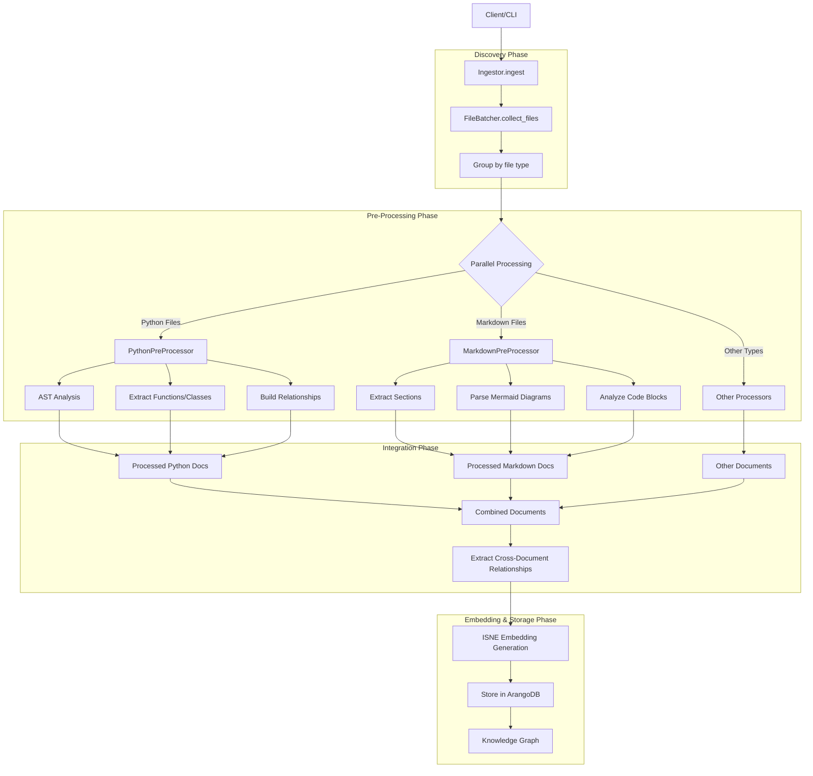
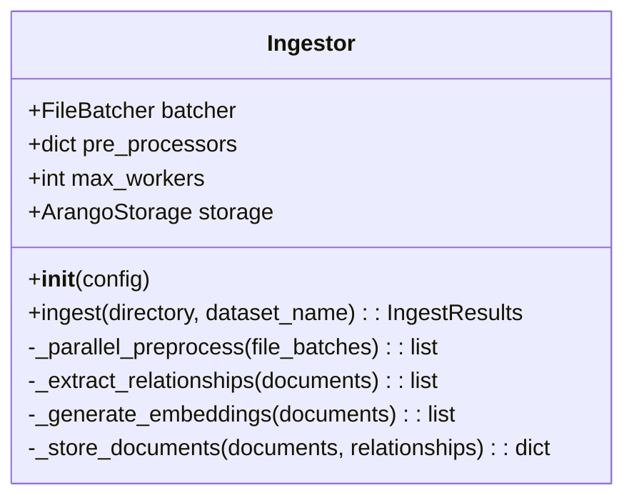
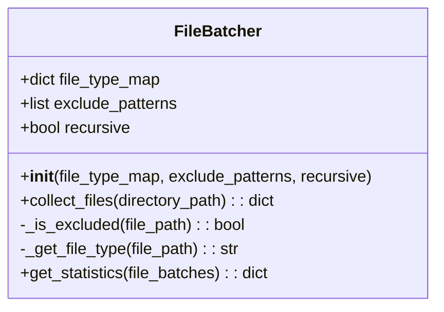
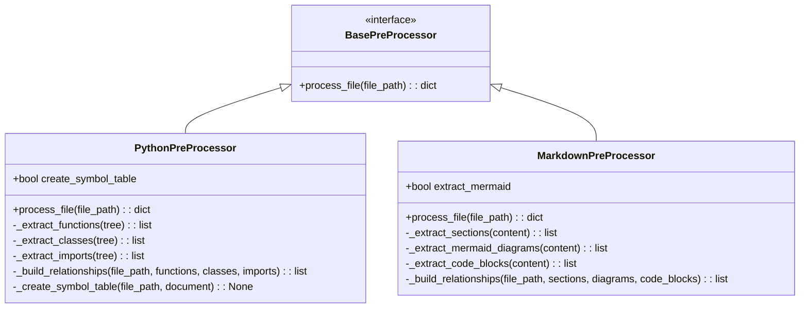
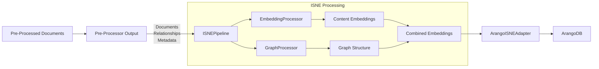
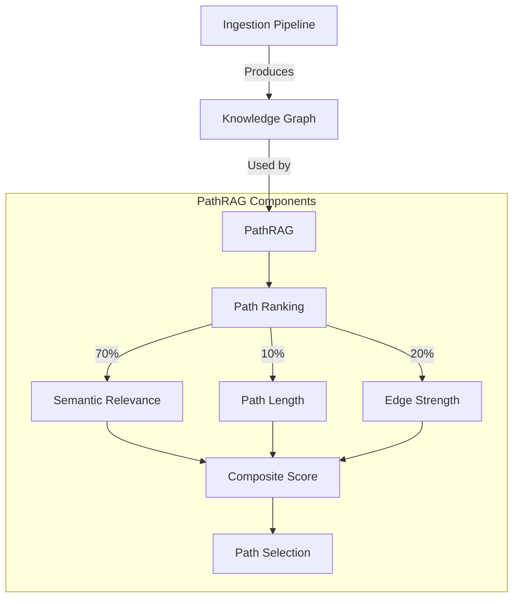
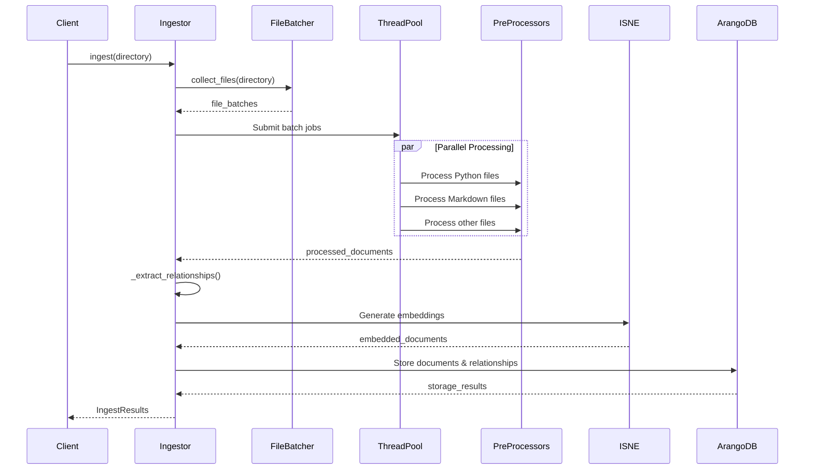

# HADES-PathRAG Ingestion Module

This directory contains the parallel data ingestion pipeline for the HADES-PathRAG project. The system processes multiple file types concurrently, extracts relationships, and prepares documents for embedding and storage in the knowledge graph.

## Architecture Overview

The ingestion system uses a modular, parallel architecture with these key components:

1. **Ingestor**: Orchestrates the entire ingestion process
2. **File Batcher**: Discovers and categorizes files by type
3. **Type-Specific Pre-Processors**: Process different file formats
4. **ISNE Integration**: Embeds documents using Inductive Shallow Node Embedding
5. **Storage**: Persists documents and relationships to ArangoDB

## Ingestion Workflow



## Key Components and Methods

### 1. Ingestor (`ingestor.py`)

The main orchestration component that coordinates the entire ingestion process.



**Key Methods:**

- `ingest(directory, dataset_name)`: Primary entry point for ingestion
- `_parallel_preprocess(file_batches)`: Processes files in parallel by type
- `_extract_relationships(documents)`: Builds cross-document relationships
- `_generate_embeddings(documents)`: Creates embeddings for each document
- `_store_documents(documents, relationships)`: Stores all data in ArangoDB

### 2. File Batcher (`file_batcher.py`)

Handles file discovery and categorization by file type.



**Key Methods:**

- `collect_files(directory_path)`: Discovers and categorizes files
- `_get_file_type(file_path)`: Determines file type from extension
- `get_statistics(file_batches)`: Generates statistics about discovered files

### 3. Pre-Processors

Type-specific processors implement the `BasePreProcessor` interface.



**PythonPreProcessor Key Methods:**

- `process_file(file_path)`: Processes a Python file
- `_extract_functions(tree)`: Extracts function definitions
- `_extract_classes(tree)`: Extracts class definitions
- `_build_relationships(...)`: Builds code relationships

**MarkdownPreProcessor Key Methods:**

- `process_file(file_path)`: Processes a Markdown file
- `_extract_mermaid_diagrams(content)`: Extracts and parses Mermaid diagrams
- `_extract_code_blocks(content)`: Extracts code examples

### 4. ISNE Integration

The ingestion pipeline integrates with the ISNE (Inductive Shallow Node Embedding) embedding system.



#### Pre-Processor to ISNE Handoff

Pre-Processors provide ISNE with:

- **Document Content**: The actual text content (possibly with metadata)
- **Rich Relationship Data**: All relationships extracted during pre-processing
- **Document Structure**: Information about document sections and hierarchy

These components are packaged as:

- `IngestDocument` objects containing content, metadata, and partial embeddings
- `DocumentRelation` objects representing the typed connections between documents
- `IngestDataset` as a collection of documents and relationships

ISNE then leverages this data to:

1. Build a graph from the provided relationship information
2. Compute embeddings that incorporate both content and structural information
3. Enhance path-based retrieval by capturing relationship semantics in the embedding space

## Relationship to PathRAG

The ingestion pipeline directly supports the PathRAG architecture's path ranking system:



## Configuration

The ingestion pipeline is configured through a flexible configuration system:

```python
config = {
    "input_dir": "/path/to/repository",
    "max_workers": 8,  # Parallel processing threads
    "file_type_map": {
        "python": [".py", ".pyw"],
        "markdown": [".md", ".markdown"]
    },
    "preprocessor_config": {
        "python": {
            "create_symbol_table": True,
            "extract_docstrings": True
        },
        "markdown": {
            "extract_mermaid": True
        }
    },
    "embedding": {
        "model": "sentence-transformers/all-mpnet-base-v2",
        "dimension": 768,
        "batch_size": 32
    },
    "storage": {
        "database": "hades_pathrag",
        "document_collection": "documents",
        "relationship_collection": "relationships",
        "embedding_collection": "embeddings"
    }
}
```

## Parallel Processing

The ingestion pipeline leverages concurrent processing for optimal performance:



## Adding New Pre-Processors

To add support for a new file type:

1. Create a new class that extends `BasePreProcessor`
2. Implement the `process_file(file_path)` method
3. Register the pre-processor in the `PRE_PROCESSOR_REGISTRY`
4. Add the file type and extensions to the configuration

## Error Handling and Validation

The pipeline includes robust error handling to ensure that failures in processing individual files don't stop the entire ingestion process. Failed files are logged and reported in the final results.

## Integration with ISNE

The ingestion pipeline integrates with the ISNE (Inductive Shallow Node Embedding) technology to provide high-quality document embeddings that capture both content and relationship information.

## Future Enhancements

Planned enhancements for the ingestion pipeline include:

1. Additional pre-processors for more file types (PDF, HTML, etc.)
2. Enhanced parallel processing with work stealing
3. Incremental ingestion for repository updates
4. Integration with vLLM for more efficient embedding generation
