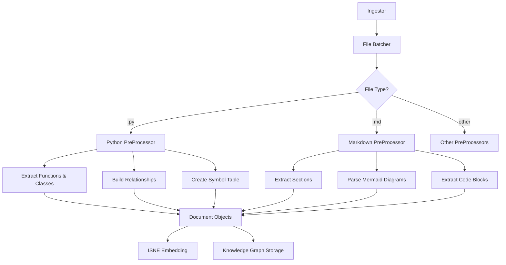

# Pre-Processor Module

This directory contains the modular pre-processing components for the parallel ingestion pipeline. It's responsible for processing different file types concurrently, extracting relationships, and preparing documents for the HADES-PathRAG knowledge graph.

## Architecture Overview

The pre-processor uses a modular, parallel architecture with these key components:

1. **Base Interface**: Defines the contract for all type-specific pre-processors
2. **Type-Specific Pre-Processors**: Specialized processors for different file formats
3. **Configuration System**: Flexible settings for controlling pre-processing behavior

## Pre-Processor Workflow



## Current Structure

- `base_pre_processor.py`: Interface defining the contract for all pre-processors
- `python_pre_processor.py`: Specialized processor for Python source code
- `markdown_pre_processor.py`: Specialized processor for Markdown documents
- `config.py`: Configuration management for the pre-processor pipeline

## Integration Points

- **Input**: Receives file batches from `file_batcher.py`
- **Output**: Produces structured documents with relationships for:
  - ISNE embedding generation
  - Knowledge graph storage in ArangoDB
  - PathRAG query processing

## Configuration

The pre-processor is configured through `config.py`, which supports:

```python
config = {
    "max_workers": 8,  # Parallel processing threads
    "file_type_map": {  # Maps file extensions to pre-processor types
        "python": [".py", ".pyw"],
        "markdown": [".md", ".markdown"]
    },
    "preprocessor_config": {  # Type-specific settings
        "python": {
            "create_symbol_table": True,
            "extract_docstrings": True
        },
        "markdown": {
            "extract_mermaid": True
        }
    }
}
```

## Adding New Pre-Processors

To add support for a new file type:

1. Create a new class that implements `BasePreProcessor`
2. Add the file type and extensions to the `file_type_map` in the configuration
3. Add any type-specific settings to the `preprocessor_config`

## Relationship with PathRAG

The pre-processor's extracted relationships directly support the PathRAG architecture's path ranking system, which uses a composite scoring system that prioritizes:

- Semantic relevance of nodes to the query (70%)
- Path length with preference for shorter paths (10%)
- Aggregate edge strength along the path (20%)
