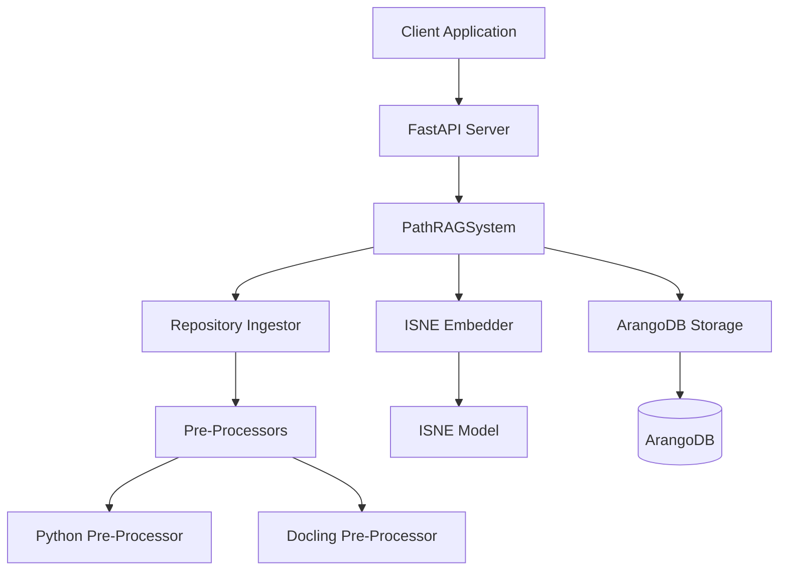

# HADES-PathRAG API

## Overview

This document describes the FastAPI-based API for HADES-PathRAG, which provides a simple interface for writing to and querying the knowledge graph. This API replaces the previously planned MCP server with a more lightweight and focused solution.

## Architecture

The API is designed around three core operations:

1. **Write** - Add or update data in the knowledge graph
2. **Query** - Retrieve information using natural language queries
3. **Status** - Check the current state of the system

### Diagram



## API Endpoints

### 1. Write Endpoint

```http
POST /write
```

Adds or updates data in the knowledge graph.

**Request Body:**

```json
{
  "content": "string",
  "path": "string (optional)",
  "metadata": {
    "additional": "information"
  }
}
```

**Response:**

```json
{
  "status": "success",
  "id": "document_id",
  "message": "Successfully processed write request"
}
```

### 2. Query Endpoint

```http
POST /query
```

Retrieves information based on a natural language query.

**Request Body:**

```json
{
  "query": "How does the authenticate function work?",
  "max_results": 5
}
```

**Response:**

```json
{
  "results": [
    {
      "content": "def authenticate(username, password):\n    # Verify user credentials\n    ...",
      "path": "/src/auth.py",
      "confidence": 0.92,
      "metadata": {
        "result_type": "function"
      }
    },
    ...
  ],
  "execution_time_ms": 125.45
}
```

### 3. Status Endpoint

```http
GET /status
```

Returns the current status of the system.

**Response:**

```json
{
  "status": "online",
  "document_count": 1250,
  "version": "0.1.0"
}
```

## Integration with HADES-PathRAG

The API integrates with the existing HADES-PathRAG components:

1. **Pre-Processors** (Python, Docling) - Process raw documents for ingestion
2. **ISNE Embedder** - Generate embeddings for documents and queries
3. **ArangoDB Storage** - Store documents, relationships, and embeddings

## Running the API Server

The API server can be started using the included CLI:

```bash
python -m src.api.cli --host 127.0.0.1 --port 8000
```

Optional parameters:

- `--reload` - Enable auto-reload for development
- `--log-level` - Set logging level (debug, info, warning, error, critical)
- `--config` - Path to configuration file

## Extensibility

This minimal API provides a solid foundation that can be extended with additional endpoints for more specific operations:

- Batch operations
- Relationship management
- Advanced path queries
- Custom embeddings
- XnX notation support (future)

## Security Considerations

For production deployments, consider implementing:

1. Authentication (OAuth2, API keys)
2. Rate limiting
3. Input validation
4. TLS/HTTPS encryption

## Advantages Over MCP Server

This FastAPI solution offers several advantages over the previously planned MCP server:

1. **Simplicity** - Focused on essential functionality
2. **Lower overhead** - Minimal dependencies and processing cost
3. **Better maintainability** - Smaller codebase with clear boundaries
4. **Standard interfaces** - Uses common REST API patterns
5. **Automatic documentation** - FastAPI generates OpenAPI/Swagger docs
6. **Type safety** - Pydantic models enforce schema validation
