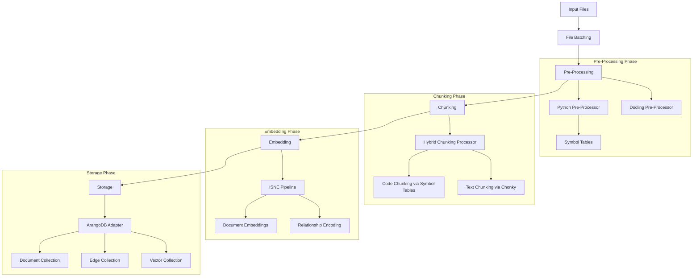
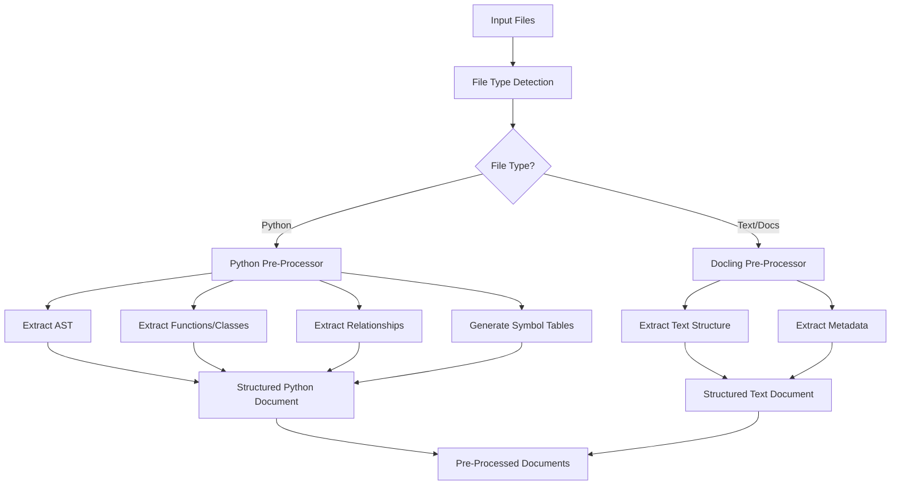
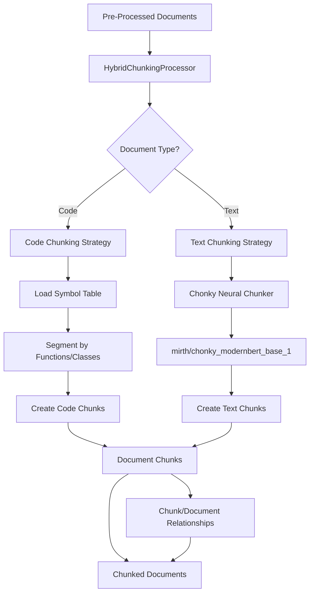
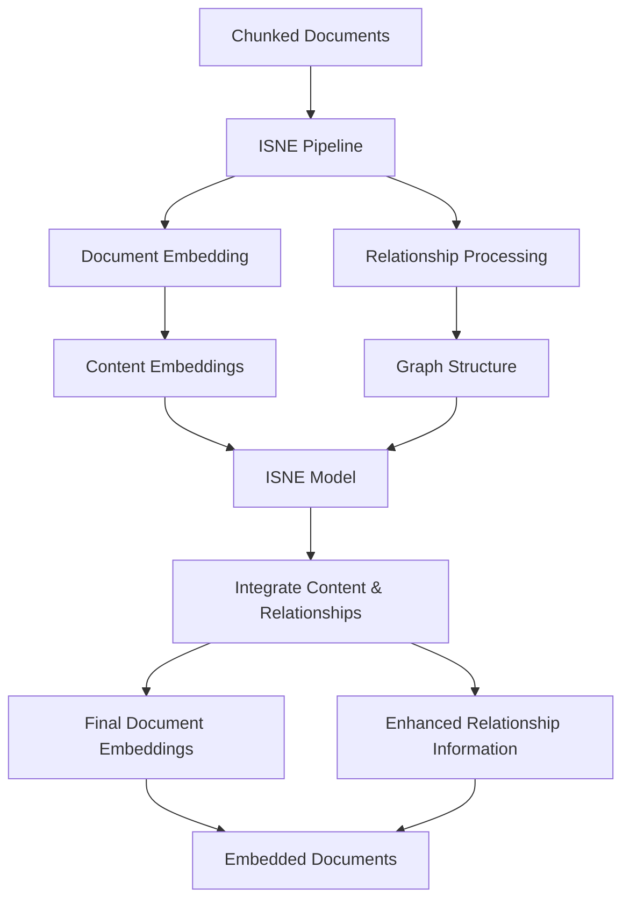
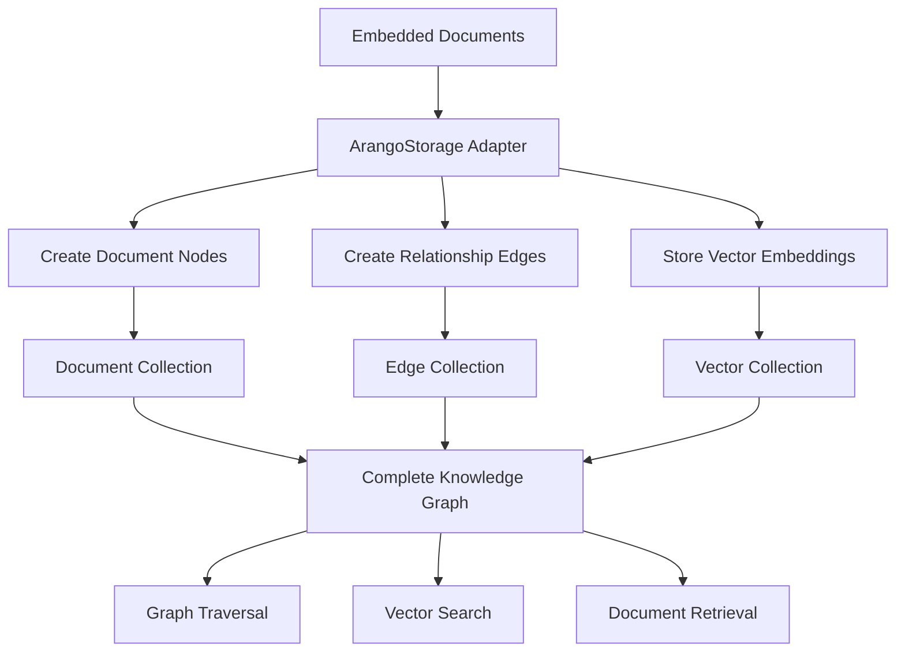
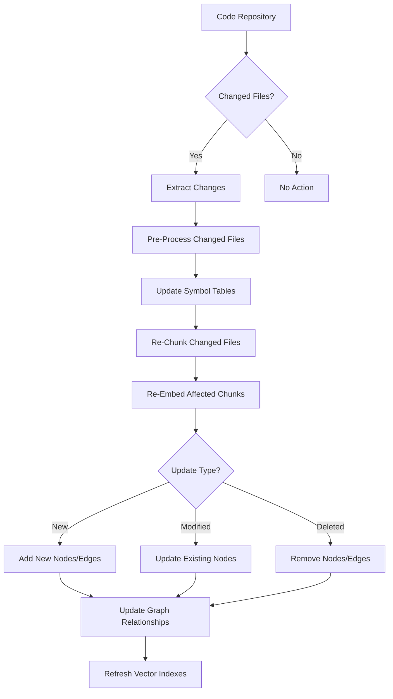
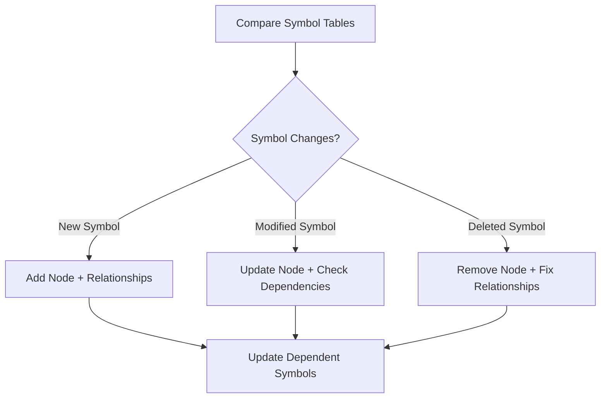
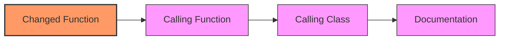

# HADES-PathRAG: Ingestion System

This document describes the comprehensive ingestion system for HADES-PathRAG, covering both the initial pipeline architecture and the incremental update process.

## Table of Contents

1. [Initial Ingestion Pipeline](#initial-ingestion-pipeline)
   - [Pipeline Overview](#pipeline-overview)
   - [Pre-Processing Phase](#1-pre-processing-phase)
   - [Chunking Phase](#2-chunking-phase)
   - [Embedding Phase](#3-embedding-phase)
   - [Storage Phase](#4-storage-phase)
2. [Incremental Update Process](#incremental-update-process)
   - [Change Detection Strategies](#change-detection-strategies)
   - [Updating Components](#updating-different-components)
   - [Cascading Update Analysis](#cascading-update-analysis)
   - [Special Cases](#handling-special-cases)
3. [Implementation Details](#implementation-details)
   - [Pre-Processors](#pre-processors)
   - [Chunking Implementation](#chunking-implementation)
   - [ISNE Integration](#isne-integration)
   - [ArangoDB Storage](#arangodb-storage)

---

## Initial Ingestion Pipeline

This section describes the end-to-end ingestion pipeline for initial processing, from file input to database storage.

## Pipeline Overview

The HADES-PathRAG ingestion pipeline consists of four main phases:

1. **Pre-Processing**: Extract structure and content from files
2. **Chunking**: Divide content into semantic chunks
3. **Embedding**: Generate embeddings that capture content and relationships
4. **Storage**: Store documents, relationships, and embeddings in ArangoDB



## 1. Pre-Processing Phase

The pre-processing phase extracts structured information from different file types.



### Pre-Processing Key Components

- **PythonPreProcessor**: Processes Python source files
  - Extracts functions, classes, imports
  - Builds relationship graph
  - Creates symbol tables for code-aware chunking
  
- **DoclingPreProcessor**: Processes text documents
  - Handles markdown, PDF, HTML, etc.
  - Extracts document structure and metadata

- **Output Format**: Structured documents with:
  - Content
  - Metadata
  - Relationships
  - Symbol information (for code)

## 2. Chunking Phase

The chunking phase segments content into semantically meaningful chunks.



### Chunking Key Components

- **HybridChunkingProcessor**: Coordinates the chunking process
  - Selects strategy based on content type
  - Creates relationships between chunks and parents
  
- **Code Chunking**: Symbol table-based chunking
  - Uses `.symbol_table` files created by PythonPreProcessor
  - Respects function/class boundaries
  
- **Text Chunking**: Chonky neural chunking
  - Uses `mirth/chonky_modernbert_base_1` model
  - Identifies semantic paragraph breaks

For detailed information about our chunking strategy, including configurations and optimization techniques, see the [Chunking Strategy](./chunking.md) document.

- **Output Format**: Original documents + chunks with:
  - Parent-child relationships
  - Chunk position information
  - Content type metadata

## 3. Embedding Phase

The embedding phase generates vector representations that capture both content and relationships.



### Embedding Key Components

- **ISNE Pipeline**: Inductive Shallow Node Embedding
  - Process both content and relationships
  - Generate embeddings that capture semantic and structural information
  
- **Embedding Process**:
  - Generate initial content embeddings
  - Process relationship information
  - Combine for final embeddings

- **Output Format**: Documents with:
  - High-dimensional vector embeddings
  - Enhanced relationship information
  - Metadata for retrieval

## 4. Storage Phase

The storage phase persists all information in ArangoDB graph database.



### Storage Key Components

- **ArangoStorage**: Adapter for ArangoDB operations
  - Handles document creation and updates
  - Manages relationship edges
  - Stores vector embeddings
  
- **Data Organization**:
  - Documents stored as nodes in document collections
  - Relationships stored as edges with types and weights
  - Embeddings stored in vector collections with indexes

- **Output**: Fully queryable knowledge graph with:
  - Combined graph and vector search capabilities
  - Metadata filtering
  - Relationship-aware retrieval

---

## Incremental Update Process

When codebases or documentation are updated, HADES-PathRAG needs to efficiently update only the affected parts of the knowledge graph. The following diagram illustrates this process:



## Change Detection Strategies

### 1. File-Based Change Detection

The system tracks changes at the file level using multiple strategies:

- **Hash-based detection**: Compare file content hashes
- **Timestamp-based detection**: Check file modification times
- **Git-based detection**: Use git diff to identify changed files
- **Semantic-based detection**: Detect meaningful content changes

```python
def detect_changes(repo_path, last_processed_state):
    current_state = scan_repository(repo_path)
    
    new_files = current_state - last_processed_state
    deleted_files = last_processed_state - current_state
    modified_files = {f for f in current_state & last_processed_state 
                     if has_changed(f, last_processed_state[f])}
    
    return new_files, modified_files, deleted_files
```

### 2. Symbol-Level Change Detection

For more granular updates, the system can track changes at the symbol level:

- Compare old and new symbol tables
- Identify added, modified, and removed symbols
- Determine impact on the dependency graph



## Updating Different Components

### 1. Updating Document Nodes

For each changed file, the system:

- Re-processes the file using the appropriate pre-processor
- Updates the document content and metadata
- Preserves the document ID for relationship consistency
- Tracks version history

```python
def update_document(file_path, doc_id):
    # Process the updated file
    updated_doc = pre_processor.process_file(file_path)
    
    # Update the node in ArangoDB
    arango_db.nodes.update({
        "_id": doc_id,
        "content": updated_doc["content"],
        "metadata": updated_doc["metadata"],
        "last_updated": datetime.now().isoformat(),
        "version": increment_version(doc_id)
    })
```

### 2. Managing Relationship Changes

When code or documentation evolves, relationships between components change:

- Function calls and imports may change
- Class hierarchies might be restructured
- Cross-references between documentation might change

The system handles this by:

```python
def update_relationships(old_doc, new_doc):
    # Find relationships that no longer exist
    removed_rels = [r for r in old_doc["relationships"] 
                   if r not in new_doc["relationships"]]
    
    # Find new relationships
    added_rels = [r for r in new_doc["relationships"] 
                 if r not in old_doc["relationships"]]
    
    # Update the graph accordingly
    for rel in removed_rels:
        arango_db.edges.remove(rel["id"])
    
    for rel in added_rels:
        arango_db.edges.create(rel)
```

### 3. Re-Chunking Content

When content changes, chunks must be updated:

1. **Removed Content**: Remove associated chunks
2. **Added Content**: Create new chunks
3. **Modified Content**: Re-chunk the affected regions
4. **Content Shifts**: Handle changes in chunk boundaries

The hybrid chunking system helps with this:

- For code: Symbol table boundaries guide chunk updates
- For text: Chonky re-establishes semantic chunks

### 4. Re-Embedding Documents

After content changes, new embeddings must be generated:

- Re-embed modified chunks
- Update relationship encoding in embeddings
- Refresh vector indexes for search

```python
def update_embeddings(updated_chunks):
    # Process through ISNE pipeline
    embedded_chunks = isne_pipeline.process(updated_chunks)
    
    # Update in database
    for chunk in embedded_chunks:
        arango_db.embeddings.update({
            "node_id": chunk.id,
            "vector": chunk.embedding,
            "model": isne_pipeline.model_version
        })
    
    # Refresh vector index
    arango_db.refresh_index("embeddings", "vector_index")
```

## Cascading Update Analysis

One of the most powerful features of PathRAG is its ability to understand the cascading effects of changes:

### 1. Direct Dependencies

When a component changes, directly dependent components are affected:

- Functions that call a changed function
- Classes that inherit from a changed class
- Documentation that references changed content

### 2. Transitive Dependencies

Changes can propagate through the graph:



### 3. Determining Update Impact

The system tracks affected components through graph traversal:

```python
def find_affected_nodes(changed_node_ids):
    affected_nodes = set(changed_node_ids)
    
    # Find nodes that depend on the changed nodes
    for node_id in changed_node_ids:
        # Use graph traversal to find dependent nodes
        dependents = arango_db.traverse(
            start_vertex=node_id,
            direction="INBOUND",  # Nodes that depend on this one
            edge_collections=["CALLS", "IMPORTS", "REFERENCES"],
            max_depth=2  # Configurable depth of impact
        )
        affected_nodes.update(dependents)
    
    return affected_nodes
```

## Handling Special Cases

### 1. File Renames and Moves

File renames and moves require special handling:

- Preserve node identities
- Update path references
- Maintain relationship integrity

```python
def handle_rename(old_path, new_path):
    # Find document by old path
    doc = arango_db.find_document_by_path(old_path)
    
    if doc:
        # Update path but keep same ID
        arango_db.update_document(doc["_id"], {"path": new_path})
        
        # Update any references to this path
        arango_db.update_references(old_path, new_path)
```

### 2. Deleted Components

When components are deleted:

- Remove the node from the graph
- Update or remove dependent relationships
- Preserve in a historical archive if needed

### 3. Major Refactoring

For major refactoring, the system can:

- Compare overall code structure before and after
- Identify moved/renamed functions and classes
- Update relationships to maintain graph coherence

### 4. Code Versioning

The system supports versioning to track changes over time:

- Store multiple versions of critical components
- Enable time-based retrieval ("as of" queries)
- Track evolution of code components

---

## Implementation Details

This section provides specific implementation details for the key components of the ingestion system.

## Pre-Processors

### Python Pre-Processor

The Python pre-processor is implemented in `src/ingest/pre_processor/python_pre_processor.py` and provides:

- AST-based parsing for accurate code structure extraction
- Symbol table generation for code-aware chunking
- Relationship extraction for imports, calls, and inheritance
- Type-safe document structure with robust error handling

Example implementation (simplified):

```python
class PythonPreProcessor(BasePreProcessor):
    def __init__(self, create_symbol_table=True):
        super().__init__()
        self.create_symbol_table = create_symbol_table
        
    def process_file(self, file_path):
        # Parse Python file
        with open(file_path, 'r') as f:
            content = f.read()
            
        tree = ast.parse(content)
        
        # Extract components
        functions = self._extract_functions(tree)
        classes = self._extract_classes(tree)
        imports = self._extract_imports(tree)
        relationships = self._extract_relationships(tree)
        
        # Create document structure
        document = {
            "path": file_path,
            "content": content,
            "type": "python",
            "functions": functions,
            "classes": classes,
            "imports": imports,
            "relationships": relationships,
            "metadata": {
                # Various metadata
            }
        }
        
        # Create symbol table if enabled
        if self.create_symbol_table:
            symbol_table_path = self._create_symbol_table(file_path, document)
            document["metadata"]["symbol_table_path"] = str(symbol_table_path)
            
        return document
```

### Docling Pre-Processor

The Docling pre-processor handles text documents with a focus on semantic structure:

- Section recognition
- Metadata extraction
- Content analysis
- Link detection

## Chunking Implementation

The hybrid chunking processor combines two strategies:

1. **Symbol-Table Based Chunking** for code
2. **Neural Chunking with Chonky** for text documents

These are integrated in the `HybridChunkingProcessor` class.

## ISNE Integration

ISNE (Inductive Shallow Node Embedding) provides several advantages for our system:

1. **Joint Content and Structure Learning**: ISNE captures both content semantics and relationship structure
2. **Inductive Nature**: Can embed new nodes without retraining
3. **Shallow Architecture**: Efficient for large graphs
4. **Relationship-Aware**: Understands the context of each document in the wider codebase

## ArangoDB Storage

ArangoDB provides a unified platform for storing:

1. **Documents**: Code and text content
2. **Relationships**: Typed edges between documents
3. **Embeddings**: Vector representations for similarity search

The storage layer is implemented with:

- `ArangoStorage` adapter for database operations
- Optimized collections for different entity types
- Vector indexing for efficient similarity search
- Graph traversal capabilities for relationship exploration

---

This comprehensive document describes both the initial ingestion pipeline and the incremental update process for the HADES-PathRAG system. It covers the architecture, implementation, and strategies for maintaining an up-to-date knowledge graph as codebases and documentation evolve.

## System Interaction

The HADES-PathRAG system exposes a clean API for interacting with the ingestion pipeline and knowledge graph. This API allows for:

- Writing new data to the knowledge graph
- Querying the knowledge graph
- Checking system status

For complete information about available endpoints, request/response formats, and usage examples, see the [API Reference](./api.md) document.
