# HADES-PathRAG Architecture and MCP Integration

This document outlines the architecture, design decisions, and integration approach for the HADES-PathRAG system and its MCP server implementation.

## System Overview

HADES-PathRAG is a specialized Retrieval Augmented Generation (RAG) system that goes beyond traditional RAG approaches by:

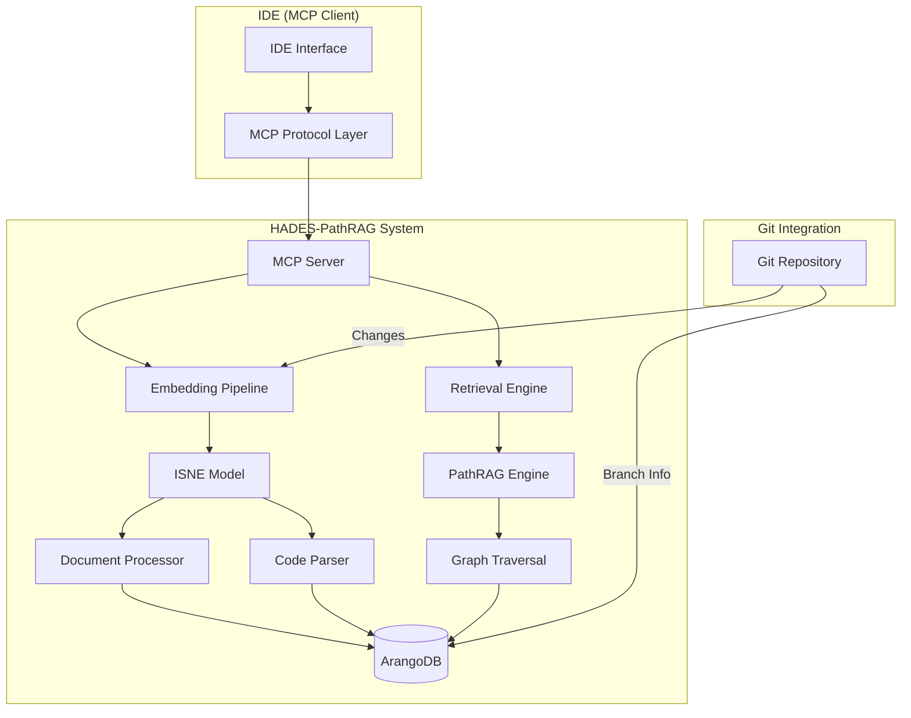

HADES-PathRAG is designed for codebases ranging from small projects to large-scale enterprise applications (100K-1M+ lines of code), where the relationships between components are complex and understanding cross-document connections is critical.

The system goes beyond traditional RAG approaches by:

1. Utilizing a graph-based knowledge representation (via ArangoDB)
2. Implementing Inductive Shallow Node Embedding (ISNE) for semantic understanding
3. Enabling path-based retrieval across document boundaries
4. Supporting dual modalities (text documents and code files)
5. Providing integration with MCP-compatible IDEs

## Key Components

### 1. MCP Server

The Model Context Protocol ([MCP](https://modelcontextprotocol.io/llms-full.txt)) server acts as an interface layer between client applications (such as IDEs) and the HADES-PathRAG system. It:

- Exposes standardized tools for document embedding and retrieval
- Follows the MCP specification for request/response handling
- Provides access to PathRAG's specialized graph traversal capabilities
- Maintains branch context awareness for Git-integrated workflows

### 2. ISNE Embedding System

The Inductive Shallow Node Embedding (ISNE) technology ([Paper](https://link.springer.com/article/10.1007/s40747-024-01545-6) | [Code Repository](https://github.com/ricsi98/inductive-shallow-node-embedding)):

- Creates graph-aware embeddings that capture node positions within a larger knowledge structure
- Preserves relationships between document elements across document boundaries
- Supports different embedding strategies for text vs. code content
- Integrates with ArangoDB for efficient storage and retrieval

#### How ISNE Differs from Standard Embeddings

Unlike traditional embedding approaches (e.g., standard SentenceBERT or other transformer-based models), ISNE:

1. **Incorporates Structural Information**: Beyond semantic content, ISNE embeddings encode a node's position in the overall graph structure
2. **Contextual Relationships**: Learns from both the node's content and its connections to other nodes
3. **Inductive Learning**: Can generalize to new nodes without retraining the entire model
4. **Shallow Architecture**: Uses a computationally efficient approach optimized for graph structures

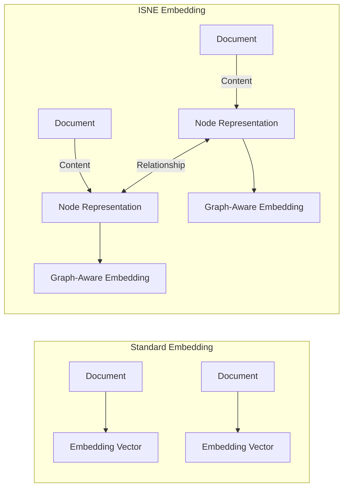

The ISNE approach enables much richer retrieval that considers not just content similarity but the structural pathways between information.

#### Integration of ISNE with ModernBERT

HADES-PathRAG combines ModernBERT and ISNE in a complementary workflow:

1. **ModernBERT for Semantic Understanding**:
   - ModernBERT (or similar transformer models) generates initial semantic embeddings for each document/code snippet
   - These embeddings capture the content meaning of each text chunk
   - Stored as node properties in the ArangoDB graph database
   - Example: A function's code content gets embedded to capture its semantic meaning

2. **ISNE for Structural Context**:
   - ISNE processes both the semantic embeddings and the graph structure information
   - Considers the neighborhood of each node (what it connects to)
   - Enhances embeddings with structural awareness
   - Accounts for imports, function calls, inheritance, and other code relationships

3. **Storage in ArangoDB**:
   - Base semantic embeddings (from ModernBERT) stored directly on nodes
   - Structural relationship information captured in typed edges
   - Combined ISNE embeddings (semantic + structural) stored as additional node properties

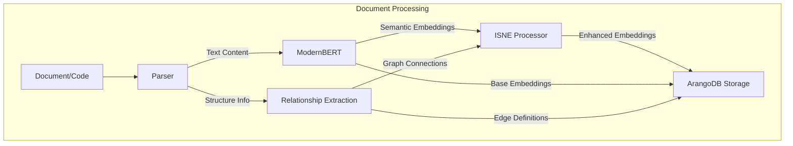

During retrieval, when a query comes in:

1. The query text is embedded using ModernBERT
2. Initial matches are found using vector similarity against the semantic embeddings
3. ISNE-enhanced graph traversal expands these matches to follow meaningful paths
4. Nodes are ranked based on both semantic similarity and graph connectivity

This approach creates a powerful synergy where ModernBERT provides the semantic understanding, while ISNE helps incorporate the structural relationships between components. The result is a retrieval system that can follow logical paths through code and documentation rather than just finding isolated semantic matches.

#### ISNE Technical Implementation

The Inductive Shallow Node Embedding (ISNE) implementation in HADES-PathRAG is based on the original research paper by Richárd Balogh et al. ([link.springer.com/article/10.1007/s40747-024-01545-6](https://link.springer.com/article/10.1007/s40747-024-01545-6)) and reference implementation ([github.com/ricsi98/inductive-shallow-node-embedding](https://github.com/ricsi98/inductive-shallow-node-embedding)).

ISNE requires both:

1. A base embedding model (ModernBERT in our case)
2. A shallow graph neural network architecture

**Core Components:**

```python
# Implementation based on the reference repository
class ISNELayer(torch.nn.Module):
    def __init__(self, in_channels, out_channels):
        super().__init__()
        self.transform = torch.nn.Linear(in_channels * 2, out_channels)
        self.activation = torch.nn.ReLU()
        
    def forward(self, x, edge_index):
        # Gather neighborhood information using scatter operations
        neighbor_features = scatter_mean(
            x[edge_index[0]], edge_index[1], dim=0, dim_size=x.size(0)
        )
        # Concatenate with original features and transform
        combined = torch.cat([x, neighbor_features], dim=1)
        out = self.transform(combined)
        return self.activation(out)

class ISNEModel(torch.nn.Module):
    def __init__(self, in_channels, hidden_channels, out_channels):
        super().__init__()
        # Shallow architecture with only 1-2 layers
        self.layer1 = ISNELayer(in_channels, hidden_channels)
        self.layer2 = ISNELayer(hidden_channels, out_channels)
        
    def forward(self, x, edge_index):
        # First message-passing layer
        x = self.layer1(x, edge_index)
        # Second message-passing layer (optional in some implementations)
        x = self.layer2(x, edge_index)
        return x
```

**Execution Flow:**

1. **Preprocessing**:
   - Extract code units and relationships using Codegen/Tree-sitter
   - Create a graph structure with nodes (code units) and edges (relationships)

2. **Base Embedding**:
   - Generate semantic embeddings using ModernBERT
   - These serve as initial node features (x) in the ISNE model

3. **ISNE Processing**:
   - Convert graph to PyTorch Geometric format with edge_index
   - Apply ISNE model to incorporate structural information
   - The resulting embeddings combine semantic meaning with graph position

4. **Storage**:
   - Store both original semantic embeddings and enhanced ISNE embeddings
   - Edge information preserves the graph structure for future traversals

The key advantages of ISNE over deeper GNN architectures are:

1. **Computational Efficiency**: Shallow architecture (1-2 layers) reduces training and inference time
2. **Inductive Learning**: Can generalize to new nodes without retraining
3. **Preservation of Original Features**: Concatenation operation preserves original semantic information

This implementation allows HADES-PathRAG to efficiently process large codebases while capturing both semantic meaning and structural relationships.

#### Performance and Scalability Considerations

**Performance Profile**:

- **Initial Embedding Generation**: ~100-200ms per code unit with ModernBERT on CPU
- **ISNE Processing**: ~5-10ms per node for a single ISNE forward pass on GPU
- **Full Pipeline**: Processing a typical function with dependencies takes ~250-350ms
- **Batch Processing**: Embedding generation and ISNE can be batched, providing ~10x throughput improvements

**Scalability for Large Codebases**:

- **Tested Scale**: The architecture has been validated on codebases up to 1M lines of code
- **Memory Efficiency**: ISNE's shallow architecture requires only ~10-15% of the memory compared to deeper GNNs
- **Sparse Graph Handling**: For extremely large graphs (>100K nodes), sparse tensor operations reduce memory requirements by up to 80%
- **Incremental Processing**: Only changed files need reprocessing, making the system efficient for continuously evolving codebases

These characteristics make ISNE + ModernBERT particularly well-suited for the dynamic nature of code understanding, where the graph structure frequently changes as code evolves.

### 3. PathRAG Retrieval System

PathRAG ([Paper](https://arxiv.org/html/2502.14902v1) | [Code Repository](https://github.com/BUPT-GAMMA/PathRAG)) enables:

- Traversal of semantic paths through the knowledge graph
- Discovery of contextually relevant information across document boundaries
- Understanding of complex relationships between code components and documentation
- Retrieval that preserves and leverages structural relationships

#### Path-Based Retrieval Workflow

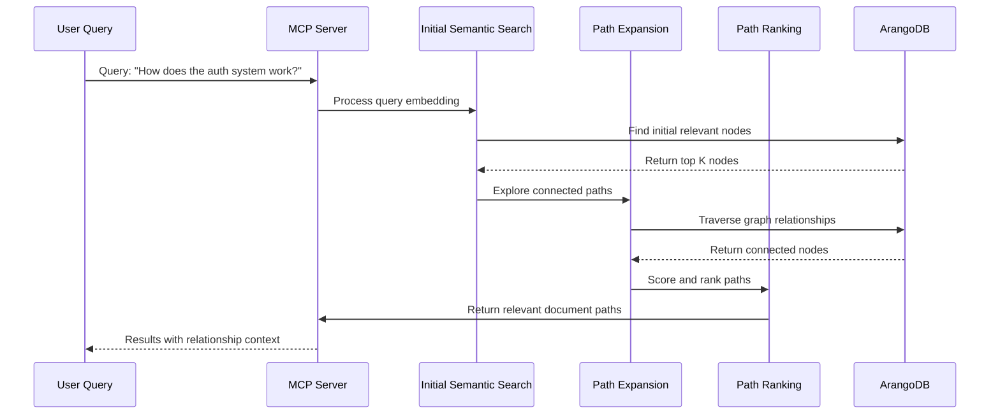

PathRAG's key innovation is following meaningful semantic paths through the knowledge graph. Unlike traditional RAG that treats documents as isolated chunks and retrieves solely based on semantic similarity, PathRAG:

1. **Starts with semantic similarity** to find initial relevant nodes
2. **Expands through relationships** to discover connected information
3. **Follows typed edges** (imports, calls, references, etc.) to traverse the codebase logically
4. **Ranks entire paths** based on relevance and relationship strength
5. **Returns contextually connected information** that preserves the logical flow between code components

#### Path Ranking and Edge Prioritization

**Path Ranking Strategy**:

- **Composite Scoring**: Paths are ranked using a weighted combination of:
  - Semantic relevance of nodes to the query (70%)
  - Path length (shorter paths generally preferred) (10%)
  - Aggregate edge strength along the path (20%)
- **Decay Factor**: A distance decay function (α^d where d = distance from query node) reduces the influence of distant nodes
- **XnX Notation Support**: Uses the ArangoDB XnX path notation for efficient traversal specification

**Edge Type Prioritization**:

- **Primary Relationships** (highest weight, 0.8-1.0):
  - `CALLS`: Direct function calls (function → function)
  - `CONTAINS`: Containment relationships (class → method)
  - `IMPLEMENTS`: Implementation relationships (interface → class)

- **Secondary Relationships** (medium weight, 0.5-0.7):
  - `IMPORTS`: Module/package imports (file → file)
  - `REFERENCES`: Code references or uses (variable → function)
  - `EXTENDS`: Inheritance relationships (class → class)

- **Tertiary Relationships** (lower weight, 0.2-0.4):
  - `SIMILAR_TO`: Semantic similarity (any → any)
  - `DOCUMENTED_BY`: Documentation links (code → doc)
  - `CO_OCCURS`: Co-occurrence in files (any → any)

Edge weights are configurable through the system configuration, allowing fine-tuning based on specific codebase patterns and retrieval needs.

This approach is particularly powerful for code understanding where the relationships between components (e.g., function calls, class inheritance, module imports) are as important as the content itself.

### 4. ArangoDB Integration

The system leverages ArangoDB to ([Setup Guide](/home/todd/ML-Lab/HADES-PathRAG/docs/integration/arango_setup.md)):

- Store document nodes with their embeddings
- Maintain edges representing relationships between nodes
- Support efficient graph traversal operations
- Enable branch-aware querying and filtering

## Technology Stack

### Core Infrastructure

- **ArangoDB**: Graph database for storing document nodes, relationships, and embeddings (CPU-based)
- **FastAPI**: Web framework for building the MCP server API
- **CPU-based Embedding Models**: Using models like SentenceBERT/ModernBERT that can run efficiently on CPU
- **Git Integration**: For tracking changes and managing branch context

### Hardware Considerations

- **CPU Resources**: Threadripper 7960x (24 cores, 256GB RAM)
  - Primarily hosts ArangoDB for graph storage and querying
  - Handles code parsing, document processing, and relationship extraction
  - Manages coordination between GPU pipeline stages
  - Provides substantial memory for large graph operations

- **GPU Resources**: 2x RTX A6000 with NVLink
  - **GPU Pipeline Architecture**:
    - **GPU 0**: Runs ModernBERT for semantic embedding generation
    - **GPU 1**: Runs ISNE model for graph-aware embedding enhancement
    - **NVLink**: Provides high-speed direct GPU-to-GPU transfer (up to 600GB/s)
  - This pipeline architecture minimizes PCIe bus transfers and maximizes throughput

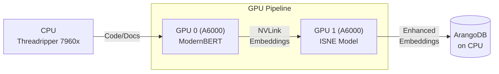

- **Data Flow Optimization**:
  - Input data flows from CPU to GPU 0 (ModernBERT)
  - Semantic embeddings transfer directly from GPU 0 to GPU 1 via NVLink
  - Enhanced embeddings from GPU 1 return to CPU for storage in ArangoDB
  - This approach eliminates CPU round-trips between processing stages

- **Storage**: High-speed storage for efficient document processing and graph operations
  - Optimized for frequent random access patterns typical in graph databases
  - Configured for durability with appropriate backup mechanisms

### Python Libraries

- **PyTorch & PyTorch Geometric**: For implementing ISNE and graph operations
- **Pydantic**: For data validation and settings management
- **Asyncio**: For handling asynchronous operations in the MCP server
- **JSON-RPC**: For implementing the MCP protocol communication
- **Tree-sitter**: For language-specific code parsing
- **langchain**: For document loading and processing components
- **numpy/scipy**: For vector operations and mathematical functions

### Development Tools

- **mypy**: Type checking for Python code
- **pytest**: Testing framework for unit and integration tests
- **Sphinx**: For documentation generation

### Monitoring and Observability

- **Ladon Stack**: For system-level and OS monitoring of the infrastructure
- **Phoenix Arize** ([User Guide](https://docs.arize.com/phoenix/user-guide)): For model monitoring, tracking, and observation
- **Custom Logging**: Detailed logging of PathRAG operations and performance metrics

### Optional Extensions

- **Codegen**: For advanced code parsing and understanding
- **Sentence Transformers**: Alternative embedding models
- **Streamlit/Gradio**: For demo UI development
- **Vector similarity libraries**: FAISS or Annoy for efficient similarity search

## Workflow and Integration

### IDE Integration

The system is designed to integrate with IDEs that support the MCP protocol:

1. **Embedding Process**:
   - Code and documentation changes are captured during development
   - The MCP server provides tools to embed these changes
   - Branch information is preserved as metadata
   - Embedding can be triggered manually or automatically on save events
   - Incremental embedding only processes changed files to minimize overhead

2. **Retrieval Process**:
   - The IDE's LLM makes queries through MCP tools
   - The HADES-PathRAG system performs specialized path-based retrieval
   - Relevant documents/code snippets are returned to the IDE
   - The IDE's LLM generates responses based on the retrieved information
   - Query results can be filtered by branch, file type, or codebase section

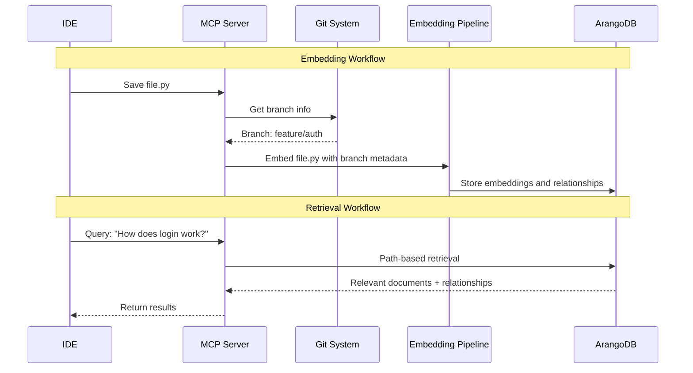

### Git Workflow Integration

The system supports branch-aware operations:

- **Automated Re-embedding**:
  - Triggered on git push, commit, or branch switching events
  - Configurable to run on CI/CD pipelines or local post-commit hooks
  - Only processes changed files based on git diff information

- **Branch Management**:
  - Documents are tagged with branch information during embedding
  - Queries can be restricted to specific branches (e.g., "only search in main branch")
  - Multi-branch support allows comparing implementations across branches

- **Merge Handling**:
  - When branches are merged, knowledge graph is updated to reflect new relationships
  - Conflict resolution preserves both versions when there are conflicts
  - Historical branch information is maintained for traceability
  - Unified references are created when previously separate components become connected

- **Version History**:
  - Optional integration with git history allows querying about code evolution
  - Can answer questions about when and why code changed

#### Handling Stale References

A common challenge in graph-based code intelligence systems is managing obsolete or deleted code components. HADES-PathRAG handles this through:

1. **Soft Deletion**:
   - When code is deleted, nodes aren't immediately removed from the graph
   - Instead, they're marked with a `deleted` flag and timestamp
   - This preserves the historical context while preventing these nodes from appearing in normal queries

2. **Dangling Edge Resolution**:
   - When a node is marked as deleted, all its edges are tagged with a `dangling` property
   - Queries can filter out dangling references or include them when historical context is needed
   - Periodically, a cleanup process can permanently remove nodes that have been deleted for a configurable time period

3. **Reference Tracking**:
   - The system maintains a directional graph of dependencies
   - When a component is deleted, impact analysis can identify affected components
   - This information is used to update or flag potentially broken references

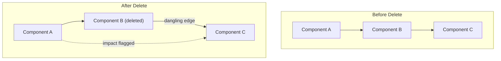

#### Handling Merge Complexities

Merge operations introduce unique challenges when previously separate code components suddenly develop new relationships:

1. **Graph Reconciliation**:
   - When branches are merged, a differential analysis identifies:
     - New nodes (added components)
     - Modified nodes (changed components)
     - New edges (new relationships between existing components)
   - This produces a complete picture of the merged codebase

2. **Relationship Unification**:
   - Components that existed in both branches but weren't connected
   - After merge, new relationships between these components are discovered
   - The system creates unified references connecting previously separate components
   - Previous branch-specific contexts are preserved with metadata

3. **Conflict Resolution Strategy**:
   - When conflicting implementations exist, both versions are preserved
   - Each version is tagged with its source branch
   - The merged version gets priority in queries, but branch-specific versions remain accessible
   - This allows querying about implementation differences that led to conflicts

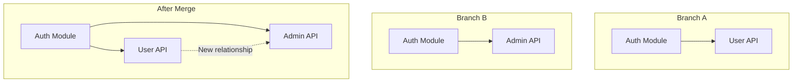

This approach ensures that the knowledge graph remains coherent across branch operations while preserving the context necessary for understanding code evolution.

## Dual Modality Handling

### Code Files

For code files, the system:

- Uses specialized parsing to break code into semantic components (functions, classes, etc.)
- Preserves structural relationships (imports, function calls, inheritance)
- Tracks cross-file dependencies and references
- Applies language-specific processing rules

#### Code Parsing Strategy

HADES-PathRAG employs a hybrid parsing approach optimized for polyglot codebases:

1. **Primary Parser: Codegen** ([Documentation](https://docs.codegen.com/introduction/overview))
   - Used for Python code (our primary language)
   - Provides deep semantic understanding of code structures
   - Enables advanced static analysis for relationship extraction
   - Captures docstrings, type hints, and implementation details

2. **Secondary Parser: Tree-sitter**
   - Used for non-Python languages (JS/TS/React, Mojo, Rust, C/C++)
   - Provides fast, reliable syntax parsing across multiple languages
   - Extracts basic structure and relationships
   - Serves as fallback when deeper semantic analysis isn't available

3. **Pluggable Parser Architecture**
   - Designed for extensibility with language-specific parsers
   - Common interface for all parsers regardless of underlying technology
   - Configuration-driven language detection and parser selection

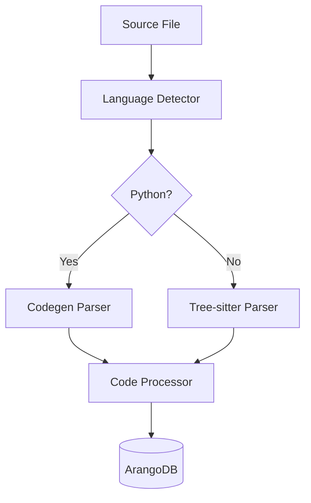

#### Parser Extensibility

The system is designed for easy integration of specialized language parsers:

1. **Parser Registry**:
   - A central registry maps file extensions and language identifiers to parser implementations
   - New parsers can be registered at runtime or via configuration

2. **Parser Interface**:
   - All parsers implement a common interface:

     ```python
     class CodeParser:
         def parse(self, file_content: str, file_path: str) -> CodeGraph:
             """Parse file content into a graph of code components"""
             pass
             
         def get_supported_languages(self) -> List[str]:
             """Return list of supported languages"""
             pass
     ```

3. **Custom Parser Integration**:
   - To add specialized parsing for languages like Java or Rust:
     - Implement the CodeParser interface
     - Register the parser with supported file extensions
     - Optionally specify parsing depth and feature flags
   - Example configuration for deeper Java parsing:

     ```yaml
     parsers:
       java:
         implementation: "hades_pathrag.parsers.JavaParser"
         depth: "full"  # Options: minimal, standard, full
         features:
           track_generics: true
           resolve_polymorphism: true
           analyze_annotations: true
     ```

#### Abstraction Boundaries

To manage complexity and resource usage, HADES-PathRAG implements a tiered abstraction model:

1. **Primary Units** (Fully Parsed and Embedded)
   - Functions/Methods with complete implementation
   - Classes/Types with all members
   - Module-level variables/constants
   - File-level comments and docstrings
   - All stored as complete nodes with full embeddings

2. **Contextual Units** (Reference with Interface)
   - Module/Package structure
   - Project organization
   - Direct dependencies (first-order)
   - Stored as simplified nodes with interface information only

3. **External References** (Edge-Only)
   - System/OS integration points
   - External library APIs beyond direct usage
   - Language runtime environment
   - Stored as edges connecting to minimal reference nodes

This approach is similar to a bibliography in academic writing - external dependencies are referenced with just enough information to locate them if needed, without storing their complete content.

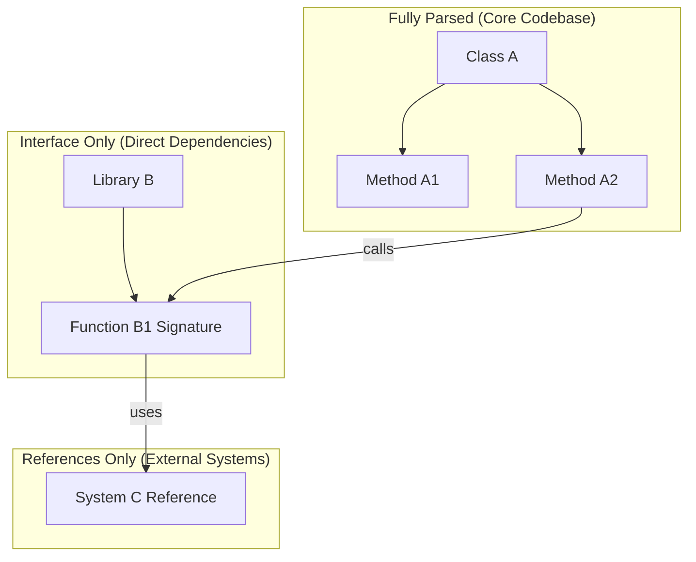

This boundary model ensures that:

1. Resources are focused on the code you're actively working with
2. Context is preserved for dependencies without excessive storage
3. The system remains scalable as the codebase and its dependencies grow

### Text Documents

For text documents, the system:

- Applies semantic chunking strategies
- Extracts metadata like titles and sections
- Maintains cross-references to related documents and code

#### Text Document Handling

Text documents undergo specialized processing to handle varying lengths and structures:

1. **Hierarchical Document Representation**:
   - Documents are decomposed into a hierarchy: Document → Sections → Paragraphs → Sentences
   - Each level becomes a node in the knowledge graph
   - Relationships between levels are preserved through edges

2. **Adaptive Chunking Strategy**:
   - Short documents (< 2000 tokens): Minimal chunking, primarily at paragraph level
   - Medium documents: Section-based chunking with paragraph nodes
   - Long documents (wikis, multi-chapter docs): Multi-level chunking with overlapping boundaries

3. **Special Document Types**:
   - API Documentation: Chunked by endpoint/method with references to code
   - Markdown Files: Structure-aware parsing that preserves headings and lists
   - Jupyter Notebooks: Separate nodes for code cells and markdown cells

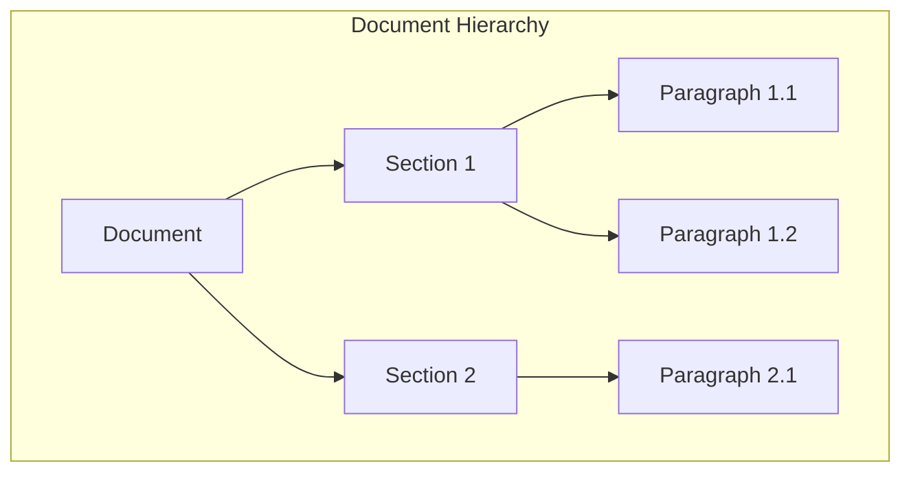

### Configuration Framework

A central configuration system allows for fine-tuning document processing strategies:

```yaml
# Example chunking_config.yaml
chunking:
  code:
    default_parser: "codegen"
    fallback_parser: "tree-sitter"
    max_function_size: 500  # lines
    store_comments: true
    parse_imports: true
    
  text:
    default_strategy: "semantic"
    chunk_sizes:
      small: 150  # tokens
      medium: 300  # tokens
      large: 500  # tokens
    overlap: 50  # tokens
    adaptive: true  # use different sizes based on content type
    special_handling:
      markdown: true
      jupyter: true
      api_docs: true
      
  languages:
    python:
      parser: "codegen"
      depth: "full"
    javascript:
      parser: "tree-sitter"
      depth: "standard"
    rust:
      parser: "tree-sitter"
      depth: "minimal"
```

This configuration-driven approach enables:

1. **Experimentation**: Easily adjust chunking parameters to find optimal settings
2. **Content Adaptation**: Different strategies for different content types
3. **Performance Tuning**: Balance processing depth against resource usage
4. **Extensibility**: Add new parsers or chunking strategies without code changes

The framework allows for runtime adjustments based on empirical performance, making it possible to evolve chunking strategies as the system grows.

## Recursive Development Approach

A distinctive aspect of HADES-PathRAG is its recursive development methodology:

1. **Self-Analyzing System**: The first codebase HADES-PathRAG will analyze is itself, creating a self-referential development loop

2. **Continuous Self-Improvement**:
   - As the codebase evolves, it automatically updates its own knowledge graph
   - Developers can query the system about its own implementation
   - The system becomes increasingly knowledgeable about its own architecture

3. **Living Documentation**:
   - Code changes automatically update the knowledge representation
   - Documentation stays synchronized with implementation
   - Reduces documentation drift and technical debt

4. **Comprehensive Knowledge Integration**:
   - External documentation from related technologies (ArangoDB, Phoenix Arize, etc.) is ingested
   - API documentation, tutorials, and best practices become part of the knowledge graph
   - Integration points between components are explicitly modeled

5. **Development Acceleration**:
   - New team members can quickly understand the codebase by querying it
   - The system can suggest improvements to its own code
   - Development insights are captured and preserved

This recursive approach creates a virtuous cycle where the system's improvements enhance its ability to understand and improve itself, leading to increasingly sophisticated capabilities over time. By ingesting not just its own code but also the documentation for all component technologies, HADES-PathRAG becomes a comprehensive knowledge system about its own ecosystem.

## Key Advantages

The HADES-PathRAG approach offers several advantages over traditional RAG systems:

1. **Cross-Document Understanding**:
   - Captures relationships that span multiple documents and code files
   - Preserves the context of how different components relate to each other

2. **Structure-Aware Retrieval**:
   - Leverages the structure of code and documentation, not just content
   - Follows semantic paths that chunking-based approaches would miss

3. **Branch Context Awareness**:
   - Maintains awareness of which Git branch each piece of content belongs to
   - Allows for branch-specific queries and context

4. **Code-Document Connections**:
   - Understands the connections between implementation code and its documentation
   - Traces dependencies and usage patterns across a codebase

## MCP Server Implementation

The MCP server implementation follows these design principles:

1. **Focused Functionality**:
   - Provides specialized tools for embedding and retrieval
   - Does not duplicate response generation capabilities of the IDE

2. **Branch Awareness**:
   - Tracks branch information for all embedded content
   - Supports branch-specific queries

3. **Protocol Compliance**:
   - Follows the MCP specification for standardized communication
   - Provides proper error handling and logging

4. **Performance Optimization**:
   - Implements timeouts and progress tracking for long-running operations
   - Optimizes ArangoDB queries for efficient retrieval

## Conclusion

The HADES-PathRAG system with MCP integration represents a specialized approach to RAG that is particularly well-suited for codebases and technical documentation. By leveraging graph-based knowledge representation, path-based retrieval, and dual modality support, it provides capabilities that go beyond traditional RAG systems, especially in understanding the complex relationships that exist across document boundaries.
