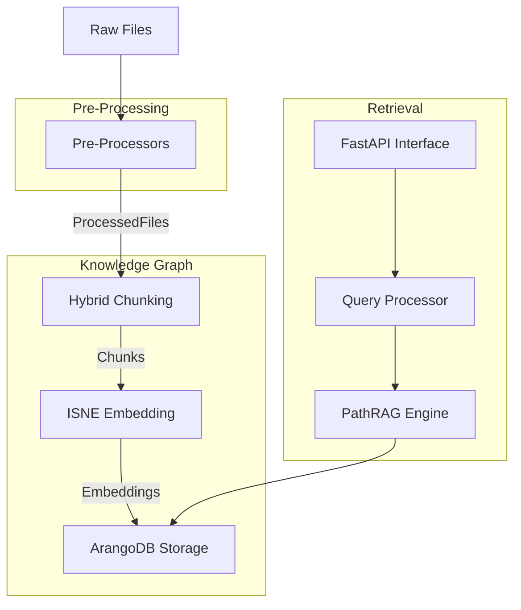

# HADES-PathRAG Documentation

This directory contains comprehensive documentation for the HADES-PathRAG project, an enhanced implementation of PathRAG with ArangoDB integration, ISNE embedding, and a FastAPI interface for efficient knowledge graph retrieval.

## Documentation Structure

### Core Components

- [Ingestion System](./ingestion_system.md) - Complete ingestion pipeline and incremental update process
- [Chunking Strategy](./chunking.md) - Hybrid chunking with semantic and code-aware approaches
- [API Reference](./api.md) - FastAPI interface for the PathRAG system

### Original PathRAG

- [`/original_paper/`](./original_paper/) - Academic research foundation
  - [Research Foundation](./original_paper/research_foundation.md) - Academic papers supporting HADES-PathRAG
  - [PathRAG Implementation](./original_paper/pathrag_implementation.md) - Connecting paper to code

### Integration Guides

- [`/integration/`](./integration/) - Guides for integrating HADES-PathRAG
  - [ArangoDB Setup](./integration/arango_setup.md) - Setting up ArangoDB for HADES
  - [HADES Integration](./integration/hades_integration.md) - Using HADES-PathRAG in broader systems
  - [Docker Deployment](./integration/docker_deployment.md) - Containerized deployment
  - [GitHub Ingestion](./integration/github_ingestion.md) - Ingesting code from GitHub repositories

### Experimental Features

- [`/xnx/`](./xnx/) - Documentation for the experimental XnX notation system
  - [Overview](./xnx/overview.md) - Introduction and core concepts

### Examples

- [`/examples/`](./examples/) - Usage examples
  - Code snippets
  - Jupyter notebooks
  - Sample applications

## Implementation Architecture

HADES-PathRAG is designed around a modular architecture that enables incremental updates to the knowledge graph and efficient retrieval:

This architecture emphasizes type safety, modularity, and efficient processing of both code and documentation.

## Key Academic References

This project builds upon several research papers:

1. [PathRAG: Pruning Graph-based Retrieval Augmented Generation with Relational Paths](https://arxiv.org/html/2502.14902v1)
2. [Inductive and Unsupervised Representation Learning on Graph Structured Objects](https://openreview.net/forum?id=rkem91rtDB)
3. [Retrieval-Augmented Generation for Knowledge-Intensive NLP Tasks](https://arxiv.org/abs/2005.11401)

## Quick Links

- [Ingestion System](./ingestion_system.md)
- [Chunking Strategy](./chunking.md)
- [API Reference](./api.md)
- [ArangoDB Integration Guide](./integration/arango_setup.md)
