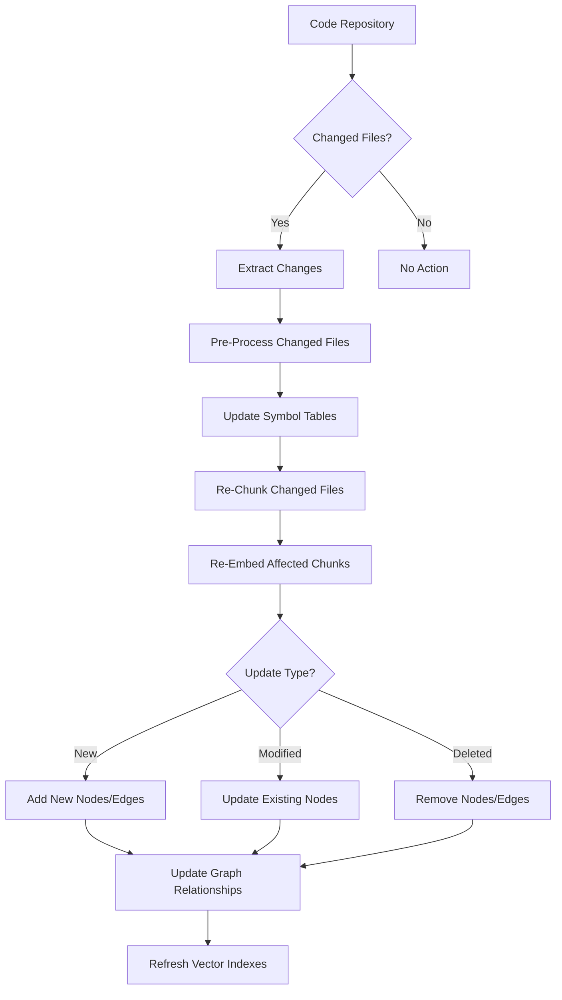
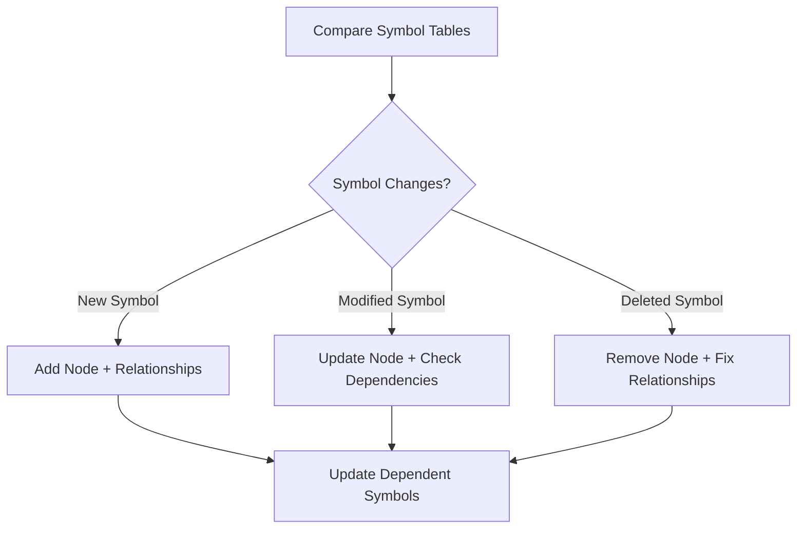
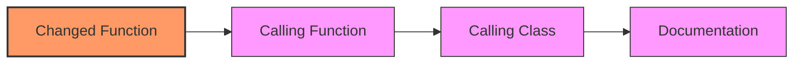
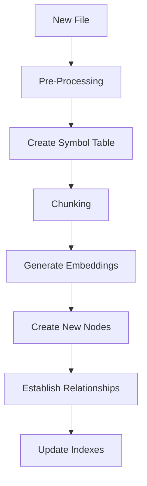
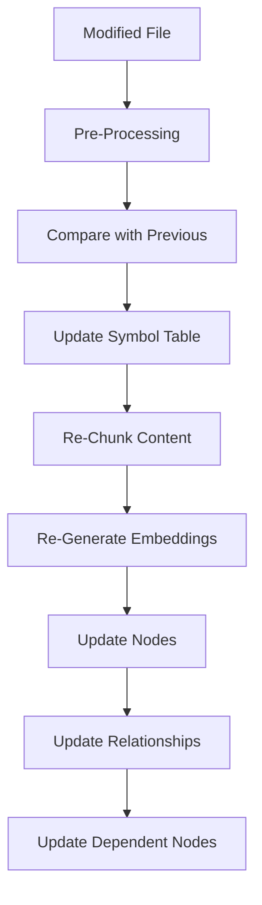
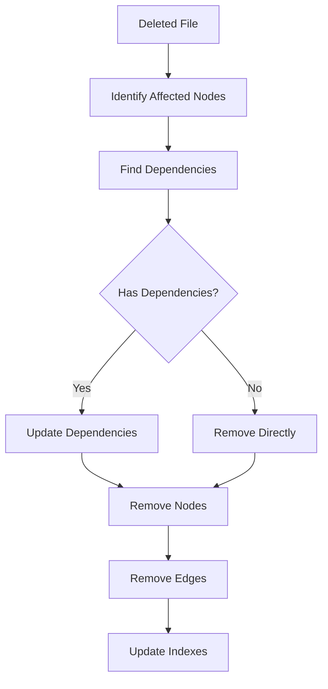
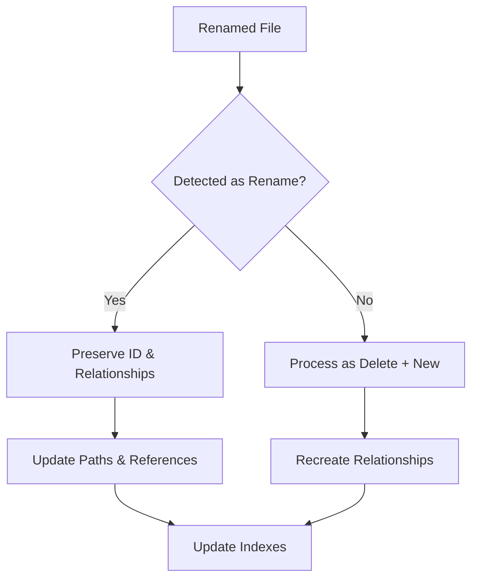

# HADES-PathRAG: Updating and Adding New Data

This document describes the process for updating existing data and ingesting new data into the HADES-PathRAG system. It covers the incremental update workflow and techniques for maintaining an up-to-date knowledge graph.

## Incremental Update Process

When codebases or documentation are updated, HADES-PathRAG needs to efficiently update only the affected parts of the knowledge graph. The following diagram illustrates this process:



## Change Detection Strategies

### 1. File-Based Change Detection

The system tracks changes at the file level using multiple strategies:

- **Hash-based detection**: Compare file content hashes
- **Timestamp-based detection**: Check file modification times
- **Git-based detection**: Use git diff to identify changed files
- **Semantic-based detection**: Detect meaningful content changes

```python
def detect_changes(repo_path, last_processed_state):
    current_state = scan_repository(repo_path)
    
    new_files = current_state - last_processed_state
    deleted_files = last_processed_state - current_state
    modified_files = {f for f in current_state & last_processed_state 
                     if has_changed(f, last_processed_state[f])}
    
    return new_files, modified_files, deleted_files
```

### 2. Symbol-Level Change Detection

For more granular updates, the system can track changes at the symbol level:

- Compare old and new symbol tables
- Identify added, modified, and removed symbols
- Determine impact on the dependency graph



## Updating Different Components

### 1. Updating Document Nodes

For each changed file, the system:

- Re-processes the file using the appropriate pre-processor
- Updates the document content and metadata
- Preserves the document ID for relationship consistency
- Tracks version history

```python
def update_document(file_path, doc_id):
    # Process the updated file
    updated_doc = pre_processor.process_file(file_path)
    
    # Update the node in ArangoDB
    arango_db.nodes.update({
        "_id": doc_id,
        "content": updated_doc["content"],
        "metadata": updated_doc["metadata"],
        "last_updated": datetime.now().isoformat(),
        "version": increment_version(doc_id)
    })
```

### 2. Managing Relationship Changes

When code or documentation evolves, relationships between components change:

- Function calls and imports may change
- Class hierarchies might be restructured
- Cross-references between documentation might change

The system handles this by:

```python
def update_relationships(old_doc, new_doc):
    # Find relationships that no longer exist
    removed_rels = [r for r in old_doc["relationships"] 
                   if r not in new_doc["relationships"]]
    
    # Find new relationships
    added_rels = [r for r in new_doc["relationships"] 
                 if r not in old_doc["relationships"]]
    
    # Update the graph accordingly
    for rel in removed_rels:
        arango_db.edges.remove(rel["id"])
    
    for rel in added_rels:
        arango_db.edges.create(rel)
```

### 3. Re-Chunking Content

When content changes, chunks must be updated:

1. **Removed Content**: Remove associated chunks 
2. **Added Content**: Create new chunks
3. **Modified Content**: Re-chunk the affected regions
4. **Content Shifts**: Handle changes in chunk boundaries

The hybrid chunking system helps with this:
- For code: Symbol table boundaries guide chunk updates
- For text: Chonky re-establishes semantic chunks

### 4. Re-Embedding Documents

After content changes, new embeddings must be generated:

- Re-embed modified chunks
- Update relationship encoding in embeddings
- Refresh vector indexes for search

```python
def update_embeddings(updated_chunks):
    # Process through ISNE pipeline
    embedded_chunks = isne_pipeline.process(updated_chunks)
    
    # Update in database
    for chunk in embedded_chunks:
        arango_db.embeddings.update({
            "node_id": chunk.id,
            "vector": chunk.embedding,
            "model": isne_pipeline.model_version
        })
    
    # Refresh vector index
    arango_db.refresh_index("embeddings", "vector_index")
```

## Cascading Update Analysis

One of the most powerful features of PathRAG is its ability to understand the cascading effects of changes:

### 1. Direct Dependencies

When a component changes, directly dependent components are affected:

- Functions that call a changed function
- Classes that inherit from a changed class
- Documentation that references changed content

### 2. Transitive Dependencies

Changes can propagate through the graph:



### 3. Determining Update Impact

The system tracks affected components through graph traversal:

```python
def find_affected_nodes(changed_node_ids):
    affected_nodes = set(changed_node_ids)
    
    # Find nodes that depend on the changed nodes
    for node_id in changed_node_ids:
        # Use graph traversal to find dependent nodes
        dependents = arango_db.traverse(
            start_vertex=node_id,
            direction="INBOUND",
            edge_collection="edges",
            max_depth=2  # Configurable depth of impact
        )
        affected_nodes.update(dependents)
    
    return affected_nodes
```

## Practical Implementation Considerations

### 1. Integration with Development Workflow

The update process can be triggered by:

- **Git hooks**: Update on commit or push
- **CI/CD pipelines**: Update as part of continuous integration
- **Scheduled jobs**: Regular checks for changes
- **Manual triggers**: On-demand updates

### 2. Optimizing Update Performance

Several strategies improve update efficiency:

- **Parallelization**: Process independent files concurrently
- **Change prioritization**: Focus on high-impact changes first
- **Progressive updates**: Update immediately used content first
- **Partial embedding**: Only re-embed changed portions

### 3. Conflict Resolution

When multiple updates affect the same components:

- Use versioning to track changes
- Implement merge strategies for conflicting updates
- Preserve relationship consistency during concurrent updates

### 4. Versioning and History

The system can maintain a history of changes:

- Track document versions over time
- Preserve previous embeddings for comparison
- Support rollback to previous states

## Handling Different Update Scenarios

### 1. Adding New Files

When new files are added to the repository:



### 2. Updating Existing Files

When files are modified:



### 3. Deleting Files

When files are removed:



### 4. Renaming Files

When files are renamed or moved:



## Measuring Update Quality

To ensure update quality, the system can:

- Compare old and new embeddings for semantic drift
- Verify relationship consistency
- Test retrieval performance on known queries
- Monitor for orphaned nodes or broken relationships

## Conclusion

The HADES-PathRAG system's graph-based architecture with semantic embedding makes it particularly well-suited for incremental updates. By understanding the relationships between components, it can efficiently update only what's needed while maintaining the integrity of the knowledge graph.

This approach ensures that as codebases and documentation evolve, the PathRAG system stays up-to-date and continues to provide accurate and contextually relevant information during retrieval.
