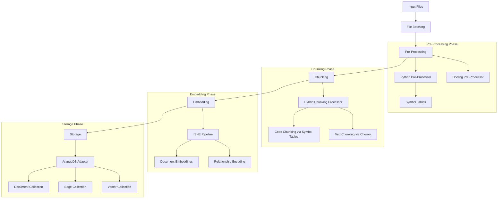
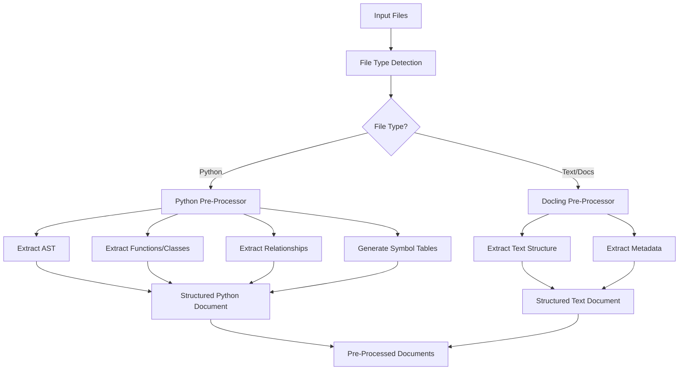
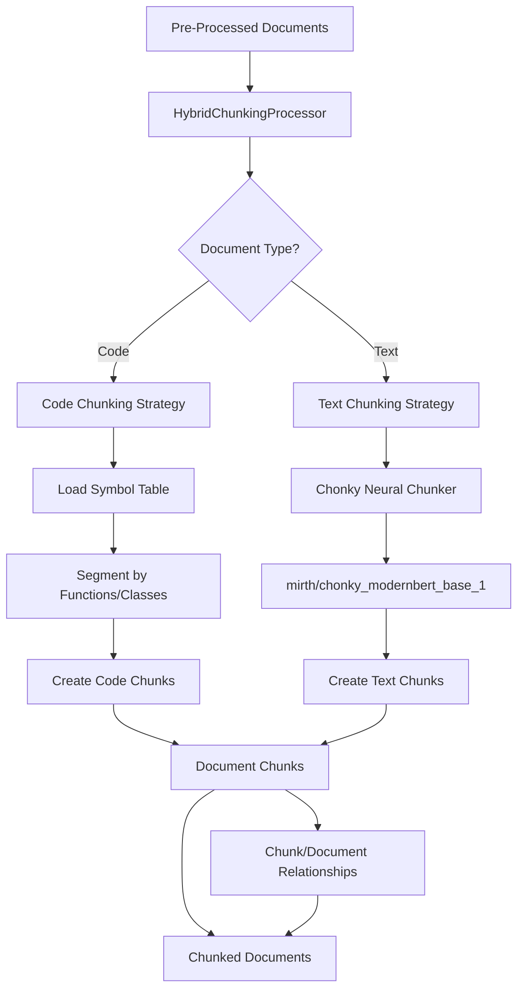
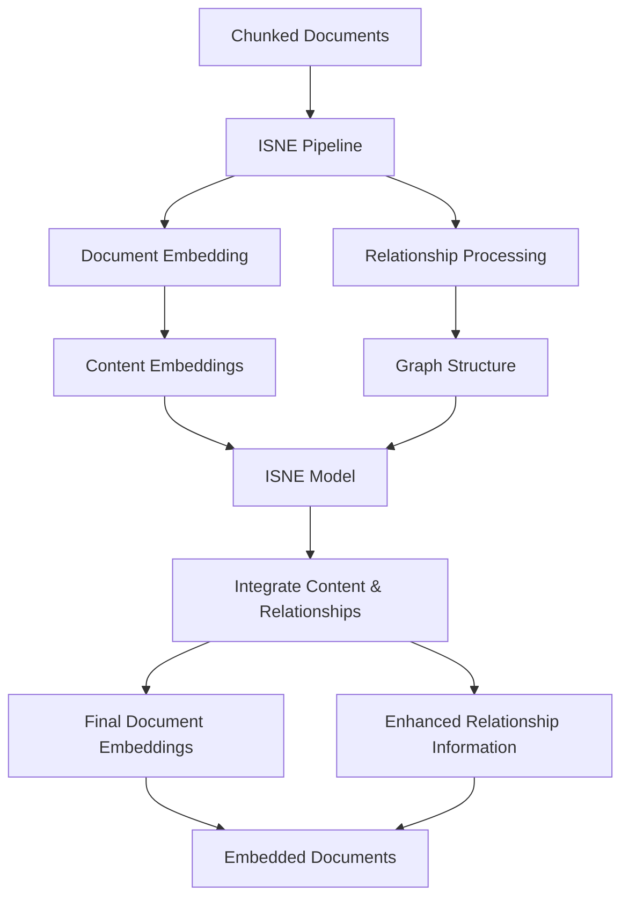
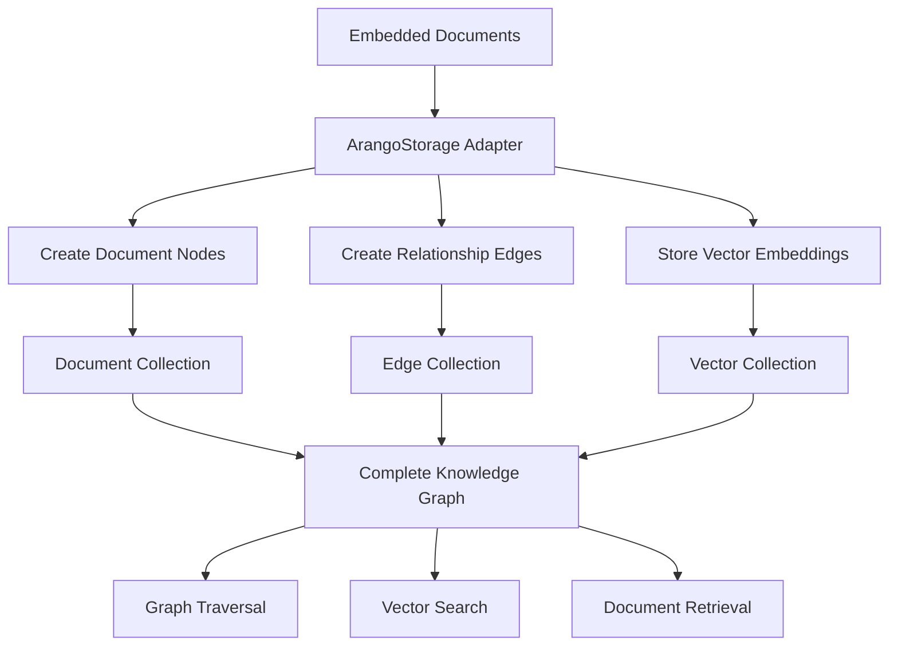
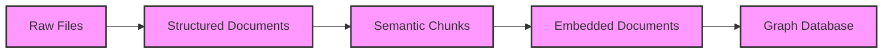

# HADES-PathRAG: Complete Ingestion Pipeline

This document describes the end-to-end ingestion pipeline for the HADES-PathRAG system, from initial file processing to database storage.

## Pipeline Overview

The HADES-PathRAG ingestion pipeline consists of four main phases:

1. **Pre-Processing**: Extract structure and content from files
2. **Chunking**: Divide content into semantic chunks 
3. **Embedding**: Generate embeddings that capture content and relationships
4. **Storage**: Store documents, relationships, and embeddings in ArangoDB

## Detailed Pipeline Components

### 1. Pre-Processing Phase

The pre-processing phase extracts structured information from different file types.

#### Key Components:

- **PythonPreProcessor**: Processes Python source files
  - Extracts functions, classes, imports
  - Builds relationship graph
  - Creates symbol tables for code-aware chunking
  
- **DoclingPreProcessor**: Processes text documents
  - Handles markdown, PDF, HTML, etc.
  - Extracts document structure and metadata

- **Output Format**: Structured documents with:
  - Content
  - Metadata
  - Relationships
  - Symbol information (for code)

### 2. Chunking Phase

The chunking phase segments content into semantically meaningful chunks.

#### Key Components:

- **HybridChunkingProcessor**: Coordinates the chunking process
  - Selects strategy based on content type
  - Creates relationships between chunks and parents
  
- **Code Chunking**: Symbol table-based chunking
  - Uses `.symbol_table` files created by PythonPreProcessor
  - Respects function/class boundaries
  
- **Text Chunking**: Chonky neural chunking
  - Uses `mirth/chonky_modernbert_base_1` model
  - Identifies semantic paragraph breaks

- **Output Format**: Original documents + chunks with:
  - Parent-child relationships
  - Chunk position information
  - Content type metadata

### 3. Embedding Phase

The embedding phase generates vector representations that capture both content and relationships.

#### Key Components:

- **ISNE Pipeline**: Inductive Shallow Node Embedding
  - Process both content and relationships
  - Generate embeddings that capture semantic and structural information
  
- **Embedding Process**:
  - Generate initial content embeddings
  - Process relationship information
  - Combine for final embeddings

- **Output Format**: Documents with:
  - High-dimensional vector embeddings
  - Enhanced relationship information
  - Metadata for retrieval

### 4. Storage Phase

The storage phase persists all information in ArangoDB graph database.

#### Key Components:

- **ArangoStorage**: ArangoDB integration
  - Maps ISNE documents to ArangoDB collections
  - Creates proper document and edge structures
  - Configures vector indexes

- **Database Structure**:
  - **nodes**: Document content and metadata
  - **edges**: Relationships between documents
  - **embeddings**: Vector representations for similarity search

- **Search Capabilities**:
  - Semantic search via vector similarity
  - Graph traversal for relationship exploration
  - Combined ranking with PathRAG algorithm

## Data Flow Transformations

The following diagram illustrates how data is transformed at each step of the pipeline:

### Transformation Details:

1. **Raw Files → Structured Documents**:
   - Extract semantic structure
   - Identify components and relationships
   - Create symbol tables

2. **Structured Documents → Semantic Chunks**:
   - Segment content by semantic boundaries
   - Preserve context and relationships
   - Different strategies for code vs. text

3. **Semantic Chunks → Embedded Documents**:
   - Generate vector representations
   - Encode relationship information
   - Combine content and structural embeddings

4. **Embedded Documents → Graph Database**:
   - Store document content
   - Represent relationships as edges
   - Configure vector indexes for search

## Performance and Scalability

The pipeline is designed for performance and scalability:

- **Parallel Processing**: Each phase can process documents in parallel
- **Batching**: Files are processed in type-specific batches
- **Caching**: Intermediate results can be cached for efficiency
- **Incremental Processing**: Support for updating existing repositories

## Configuration Options

The ingestion pipeline is highly configurable:

- **Pre-Processing**:
  - Symbol table generation
  - Relationship extraction depth
  - Metadata extraction options

- **Chunking**:
  - Chunk size and overlap
  - Chonky model selection
  - Symbol table integration options

- **Embedding**:
  - ISNE model parameters
  - Embedding dimension
  - Relationship weighting

- **Storage**:
  - ArangoDB connection settings
  - Collection configuration
  - Index optimization

## Integration Points

The ingestion pipeline provides integration points for:

- **Custom Pre-Processors**: Add support for new file types
- **Alternative Chunkers**: Replace or extend the chunking strategy
- **External Embedding Models**: Use different embedding approaches
- **Multiple Storage Backends**: Support for different databases

## PathRAG Retrieval

After ingestion, PathRAG retrieves information using a composite ranking strategy:

- **Semantic Relevance**: 70% (vector similarity)
- **Path Length**: 10% (shorter paths preferred)
- **Edge Strength**: 20% (weighted relationships)
- **Distance Decay**: Diminishing importance with distance

This creates a powerful retrieval system that combines semantic understanding with structured knowledge.
