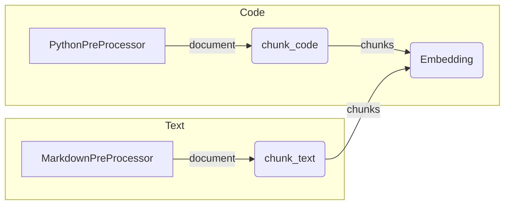

# Hybrid Chunking Strategy for HADES-PathRAG

## Overview

HADES-PathRAG supports first-class chunking utilities out of the box:

| Content type | Entrypoint | Strategy |
|--------------|-----------|----------|
| Python code  | `chunk_code` | AST walk – emits one chunk per function / class plus a *module* chunk |
| Markdown / plain-text | `chunk_text` | [Chonky](https://github.com/mithril-security/chonky) semantic paragraph splitter |

Both helpers live in `src.ingest.chunking` and share a **single public interface** so downstream components (embedding, ingestion, RAG) can treat code & text uniformly.

```python
from src.ingest.chunking import chunk_code, chunk_text

# code_doc & text_doc are outputs from the relevant pre-processors
code_chunks = chunk_code(code_doc)                       # ← list[dict]
text_chunks_json = chunk_text(text_doc, output_format="json")  # ← JSON string
```

### Output format toggle

`chunk_code` and `chunk_text` accept an optional `output_format` parameter:

* **"python"** (default) – returns `list[dict]`
* **"json"** – returns a JSON string (`json.dumps(..., indent=2)`)

This allows seamless integration with pipelines that expect raw Python objects *or* need to stream JSON to external services.

## Implementation Details

Internally the package is split into two sub-modules:

* `code_chunkers/ast_chunker.py` – walks the AST, respects token budgets, and attaches rich symbol metadata.
* `text_chunkers/chonky_chunker.py` – lazy-loads a Chonky `ParagraphSplitter`, converts its generator output to chunks, and supports the new `output_format` switch.

Both are wired through `src.ingest.chunking.code_chunkers.__init__.py`, which dispatches on document `type`.



### Chunk schema

Every chunk dict contains at minimum:

| Field | Example | Notes |
|-------|---------|-------|
| `id` | `chunk:abc123` | 8-char UUID suffix |
| `parent` | `doc:deadbeef` | Hash of source path |
| `path` | `src/foo/bar.py` | Original file path |
| `type` | `python`, `markdown` | Document type |
| `content` | *string* | The chunk’s text |
| `symbol_type` | `function`, `class`, `paragraph` | High-level category |

Extra language-specific fields (e.g. `name`, `line_start`, `line_end`) are included where relevant.

## Configuration

Chunking defaults live in `src/config/chunker_config.yaml`. Override values (e.g. alternative Chonky model, max token budget) either via that file or programmatically:

```python
from src.config.chunker_config import get_chunker_config

cfg = get_chunker_config("chonky")
cfg["max_tokens"] = 1024
```

## Dependency

Add to `pyproject.toml` / `requirements.txt`:

```toml
chonky>=0.1.0
```

GPU acceleration is optional – pass `device="cuda:0"` to `chunk_text` or set it in the config.

## Testing

The following pytest suites cover chunking behaviour:

* `tests/test_chunk_integration.py` – end-to-end pipeline
* `tests/test_text_chunker.py` – Chonky specifics & JSON mode
* `tests/test_chunk_output_format.py` – JSON round-trip for both code & text

Run:

```bash
pytest -q tests/test_chunk_*  # fast, no DB required
```

## Next steps

Chunking is now stable and documented.  Future enhancements might include:

* Language-aware code chunkers for JavaScript, Java, etc.
* Automatic token-aware re-chunking for oversize functions / paragraphs.
* Parallel Chonky inference with `torch.multiprocessing` for large corpora.

---
*Last updated: April 30 2025*
