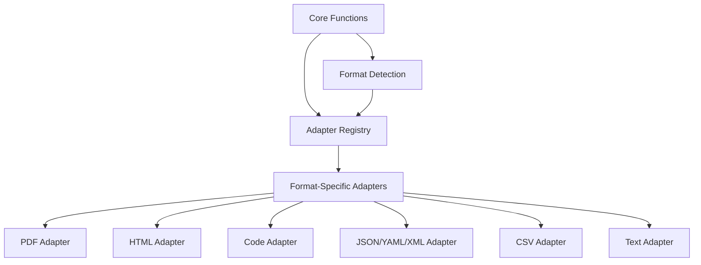

# Document Processing (docproc) Module

## Overview

The `docproc` module is a standalone, unified document processing system designed to handle various file formats and extract structured information with format-specific awareness. This module serves as the foundation for HADES-PathRAG's document ingestion pipeline and can be used independently for RAG systems, direct model inference, and processing chat attachments.

## Table of Contents

1. [Architecture](#architecture)
2. [Supported Formats](#supported-formats)
3. [Core Components](#core-components)
4. [Adapters](#adapters)
5. [Integration with Pre-Processors](#integration-with-pre-processors)
6. [Usage Examples](#usage-examples)
7. [Extension Points](#extension-points)

## Architecture

The `docproc` module follows a robust adapter-based architecture:



Key design principles:

- **Format awareness**: Each adapter understands the specific structure of its target format
- **Unified interface**: Common methods across all adapters
- **Extensibility**: Easy to add support for new formats
- **Error handling**: Robust error handling with detailed context
- **Type safety**: Comprehensive type annotations

## Supported Formats

The module currently supports the following formats:

| Format | File Extensions | Adapter | Features |
|--------|----------------|---------|----------|
| PDF | .pdf | PDFAdapter | Page extraction, table detection, figure extraction |
| HTML | .html, .htm | HTMLAdapter | Document structure, links, metadata |
| Markdown | .md, .markdown | MarkdownAdapter | Headers, links, code blocks |
| Python | .py | CodeAdapter | Functions, classes, imports, relationships |
| Other Code | .js, .ts, .java, etc. | CodeAdapter | Language-specific parsing |
| JSON | .json | JSONAdapter | Schema detection, field extraction |
| YAML | .yaml, .yml | YAMLAdapter | Schema detection, field extraction |
| XML | .xml | XMLAdapter | Tag structure, attributes |
| CSV | .csv | CSVAdapter | Headers, data types, row extraction |
| Plain Text | .txt | TextAdapter | Basic text extraction, paragraph detection |

## Core Components

### Format Detection

The `format_detector.py` module provides utilities to detect the format of a document:

```python
from src.docproc.utils.format_detector import detect_format_from_path, detect_format_from_content

# Detect format from file path
format_type = detect_format_from_path("/path/to/document.pdf")  # Returns "pdf"

# Detect format from content
with open("/path/to/file.txt", "r") as f:
    content = f.read()
    format_type = detect_format_from_content(content)  # Returns best guess based on content
```

### Core Processing Functions

The `core.py` module provides the main entry points for document processing:

```python
from src.docproc.core import process_document, process_text

# Process a document file
result = process_document("/path/to/document.pdf")

# Process text content
result = process_text("Some text content", format_override="markdown")
```

## Adapters

Each adapter implements the `BaseAdapter` interface:

```python
class BaseAdapter(ABC):
    @abstractmethod
    def process(self, file_path: Path, options: Optional[Dict[str, Any]] = None) -> Dict[str, Any]:
        """Process a file and return structured content"""
        
    @abstractmethod
    def process_text(self, text: str, options: Optional[Dict[str, Any]] = None) -> Dict[str, Any]:
        """Process text content and return structured content"""
        
    @abstractmethod
    def extract_entities(self, content: Union[str, Dict[str, Any]]) -> List[Dict[str, Any]]:
        """Extract entities from content"""
        
    @abstractmethod
    def extract_metadata(self, content: Union[str, Dict[str, Any]]) -> Dict[str, Any]:
        """Extract metadata from content"""
        
    @abstractmethod
    def convert_to_markdown(self, content: Union[str, Dict[str, Any]]) -> str:
        """Convert content to markdown format"""
        
    @abstractmethod
    def convert_to_text(self, content: Union[str, Dict[str, Any]]) -> str:
        """Convert content to plain text"""
```

### Adapter Registry

The `adapter_registry.py` module manages the registration and retrieval of adapters:

```python
from src.docproc.adapter_registry import get_adapter, register_adapter

# Get adapter for a specific format
pdf_adapter = get_adapter("pdf")

# Register a custom adapter
register_adapter("custom_format", CustomAdapter)
```

## Integration with Pre-Processors

The document processing module integrates with the existing pre-processor system through an adapter pattern:

```python
from src.ingest.pre_processor.base_pre_processor import DocProcAdapter
from src.docproc.core import process_document

# Create an adapter for PDF processing
pdf_processor = DocProcAdapter(format_override="pdf")

# Process a PDF file
result = pdf_processor.process_file("/path/to/document.pdf")
```

The adapter pattern ensures backward compatibility while leveraging the improved document processing capabilities of the new module.

## Usage Examples

### Processing a PDF Document

```python
from src.docproc.core import process_document

result = process_document("/path/to/document.pdf")

# Access structured content
text = result["content"]
metadata = result["metadata"]
entities = result["entities"]
relationships = result["relationships"]

# Convert to markdown for display
markdown = result["markdown"]
```

### Processing Code Files

```python
from src.docproc.core import process_document

result = process_document("/path/to/code.py")

# Access code structure
functions = [e for e in result["entities"] if e["type"] == "function"]
classes = [e for e in result["entities"] if e["type"] == "class"]
imports = [e for e in result["entities"] if e["type"] == "import"]

# Access relationships (e.g., function calls, imports)
for rel in result["relationships"]:
    print(f"{rel['source']} {rel['type']} {rel['target']}")
```

### Batch Processing Multiple Files

```python
from src.docproc.core import process_document
from pathlib import Path

directory = Path("/path/to/documents")
results = {}

for file_path in directory.glob("**/*.*"):
    try:
        result = process_document(file_path)
        results[str(file_path)] = result
    except Exception as e:
        print(f"Error processing {file_path}: {e}")
```

## Extension Points

The document processing module is designed to be easily extended:

1. **Add a new adapter** by implementing the `BaseAdapter` interface
2. **Register the adapter** using the adapter registry
3. **Add format detection** rules to the format detector

Example of adding a new adapter:

```python
from src.docproc.adapters.base import BaseAdapter
from src.docproc.adapter_registry import register_adapter

class CustomAdapter(BaseAdapter):
    # Implement required methods
    
    def process(self, file_path, options=None):
        # Custom implementation
        
    # Implement other required methods

# Register the adapter
register_adapter("custom_format", CustomAdapter)
```

This enables the system to handle new document formats with format-specific awareness.
